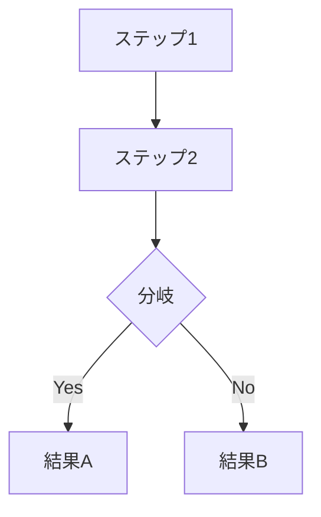
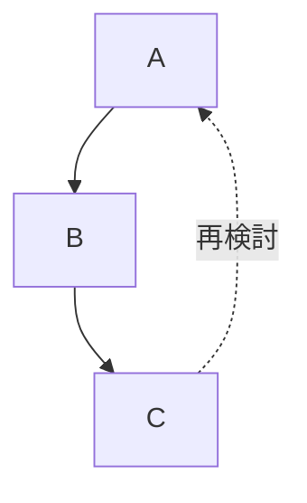

# Mermaid 図の作成ガイド

VitePress ドキュメントで mermaid 図を使用する際のガイドライン。

## 基本方針

**シンプルに保つ** - mermaid は複雑な図式化には向いていない。詳細はテキストで補足し、図は概要のみを表現する。

## 推奨する使い方

### シンプルなフローチャート



- ノード数は **5〜7個程度** に抑える
- 分岐は **1〜2箇所** まで
- 詳細は下のテキストで説明する

### 点線で「戻る」フローを表現



## 避けるべきパターン

### subgraph の多用

```mermaid
# NG: 複雑すぎる
flowchart TD
    subgraph step1["ステップ1"]
        A1 --> A2 --> A3
    end
    subgraph step2["ステップ2"]
        B1 --> B2
    end
    step1 --> step2
```

**問題点:**
- レイアウトが崩れやすい
- 文字が見切れる
- スペースの過不足が発生する

**代替案:** subgraph を使わず、シンプルなノードで表現する

### 日本語の ID

```mermaid
# NG: 日本語 ID はエラーになる
flowchart TD
    予約受付 --> 行程作成

# OK: ID は英数字、ラベルは日本語
flowchart TD
    A[予約受付] --> B[行程作成]
```

## 記法ルール

| 要素 | 記法 | 例 |
|------|------|-----|
| ノード ID | 英数字のみ | `A`, `step1`, `node_1` |
| ラベル | `["日本語OK"]` | `A["予約受付"]` |
| 矢印 | `-->` | `A --> B` |
| 点線矢印 | `-.->` | `A -.-> B` |
| ラベル付き矢印 | `-->\|ラベル\|` | `A -->\|合意\| B` |
| 分岐（ひし形） | `{テキスト}` | `A{顧客合意}` |

## VitePress での設定

mermaid のセットアップが必要な場合は、`docs/.vitepress/config.ts` の markdown 設定で対応する。
現在は未設定（将来追加予定）。
