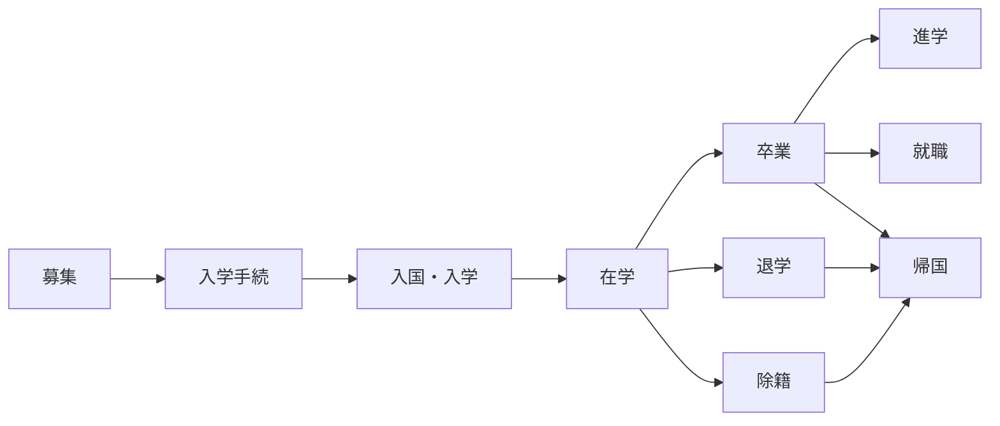

# 業務フロー — 学生のライフサイクル

## 学生ライフサイクル全体像

学生は「募集」から始まり、入学手続・入国を経て在学期間に入ります。在学中は出席管理・学費管理・生活支援が並行して行われ、最終的に卒業・退学・除籍のいずれかで在籍が終了します。卒業後は進学・就職・帰国のいずれかの進路に進みます。

## 入学コホート

年4回の入学時期があり、それぞれ在籍期間が異なります。

| コホート | 入学月 | 在籍期間 | 卒業月 |
|----------|--------|----------|--------|
| 4月生 | 4月 | 2年間 | 翌々年3月 |
| 7月生 | 7月 | 1年9ヶ月 | 翌々年3月 |
| 10月生 | 10月 | 1年6ヶ月 | 翌々年3月 |
| 1月生 | 1月 | 1年3ヶ月 | 翌年3月 |

::: tip コホートの重要性
入学コホートは、在留資格申請のタイミング、カリキュラム編成、学費請求スケジュールなど、あらゆる業務の基準になります。
:::

## 入学までの流れ

入学までには以下の7つのステップがあります。

| ステップ | 内容 | 主な担当 |
|----------|------|----------|
| 1. エージェント経由で募集 | 海外のエージェントが学生を募集・選考 | エージェント |
| 2. 書類受領・審査 | 学歴証明・経費支弁書類等を受領し、学校側で審査 | 事務局 |
| 3. 在留資格認定証明書（COE）申請 | 入管に申請書類を提出 | 事務局 |
| 4. COE交付・送付 | 交付されたCOEをエージェント経由で学生に送付 | 事務局 |
| 5. ビザ申請・取得 | 学生が現地の日本大使館でビザを取得 | 学生・エージェント |
| 6. 入国・空港出迎え | 来日時に空港で出迎え、寮へ案内 | 事務局・生活支援 |
| 7. 入学式・オリエンテーション | 入学式の実施、生活ルール・学校規則の説明 | 事務局・教務 |

::: warning 注意点
COE申請から交付まで通常1〜3ヶ月かかるため、入学月から逆算してスケジュールを管理する必要があります。
:::

## 生活支援業務

入学後は、学生の日本での生活を支援するさまざまな業務が発生します。

### 寮の準備

- 入国前に寮の部屋を割り当て
- 家具・寝具・生活必需品の準備
- 入居時の説明（ゴミ出し、ルール等）

### アルバイト紹介

- 資格外活動許可の取得支援
- アルバイト先の紹介・マッチング
- **週28時間の就労制限**の管理・指導

::: danger 週28時間制限
留学生のアルバイトは週28時間以内（長期休暇中は1日8時間以内）が法律で定められています。超過すると在留資格の更新が不許可になるリスクがあり、学校の管理責任も問われます。勤務先が複数ある場合は合算で管理が必要です。
:::

### 生活指導

- 日本の生活ルール・マナーの指導
- 近隣住民とのトラブル対応
- 災害時の対応指導

### 病院付き添い

- 体調不良時の病院手配・付き添い
- 国民健康保険の加入手続き支援
- 通訳が必要な場合の対応

### 進路指導

- 卒業後の進路相談（進学・就職・帰国）
- 大学・専門学校への推薦書作成
- 就職活動支援（履歴書添削、面接練習）
