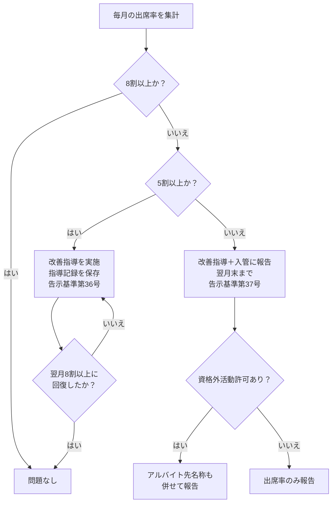

# データ — 出席率の基準と管理

## 出席率の基準値

| 基準 | 値 | 影響 | 根拠 |
|------|-----|------|------|
| 告示抹消ライン | 出席率7割未満 | 全学生の6か月平均が7割未満で告示抹消 | 告示基準 第2条第3号 |
| 在留期間更新の下限 | 出席率70%未満 | 原則更新不許可 | 入管運用基準 |
| 理由書必要ライン | 出席率70〜80%未満 | 在留期間更新に理由書・疎明資料が必要 | 入管運用基準 |
| 指導記録が必要なライン | 出席率8割未満 | 指導記録の作成・保存が必須。8割以上になるまで指導継続 | 告示基準第36号 |
| 入管報告ライン | 出席率5割未満 | 該当月の翌月末までに入管に報告。アルバイト先名称も報告 | 告示基準第37号 |
| 適正校維持の参考値 | 出席率8割以上 | クラスI維持の目安 | — |

## 出席率の計算方法

| 項目 | 内容 |
|------|------|
| 計算式 | 出席した単位時間数 ÷ 出席すべき単位時間数 |
| 1単位時間 | 45分以上 |
| 月単位の出席率 | 個々の学生ごとに月単位で計算 |
| 6か月出席率 | 全学生の6か月間の出席率（年2回報告用） |

## 報告対象期間と報告期限

| 区分 | 対象期間 | 報告期限 | 報告先 | 根拠 |
|------|----------|----------|--------|------|
| 前期 | 4月1日〜9月30日 | 12月末まで | 管轄の地方入管局 | 告示基準第35号 |
| 後期 | 10月1日〜翌年3月31日 | 6月末まで | 管轄の地方入管局 | 告示基準第35号 |

### 報告内容

| 項目 | 詳細 |
|------|------|
| 全体の出席率 | 全学生の6か月間の出席率 |
| 個別の出席状況 | 個々の学生ごとの月単位の出席状況 |
| 報告方法 | 電子届出システム または 書面 |

## 出席率に基づく対応フロー

## 指導記録の保存要件

| 項目 | 内容 |
|------|------|
| 対象 | 月間出席率8割未満の学生 |
| 内容 | 改善のための指導内容を記録 |
| 継続 | 8割以上に回復するまで指導を継続 |
| 保存期間 | 当該学生が在籍しなくなってから少なくとも1年間 |

## 出席率と在留期間更新の関係

| 出席率 | 更新の可否 | 追加書類 |
|--------|-----------|----------|
| 80%以上 | 問題なし | なし |
| 70〜80%未満 | 条件付き可 | 理由書、診断書等の疎明資料、推薦状 |
| 70%未満 | 原則不許可 | — |

::: warning 重要
出席率70%未満の学生は在留期間の更新が原則不許可になります。出席率の低下が見られた時点で早期に指導を開始することが重要です。
:::

## 関連カテゴリ

- [11 入管報告・届出](/01-domain-knowledge/11-immigration-report/) — 出席率報告の手続き詳細
- [02 学生管理](/01-domain-knowledge/02-student-management/) — 学生の在籍管理
