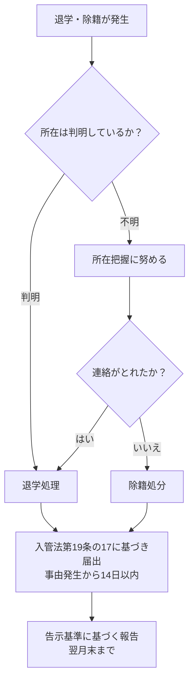
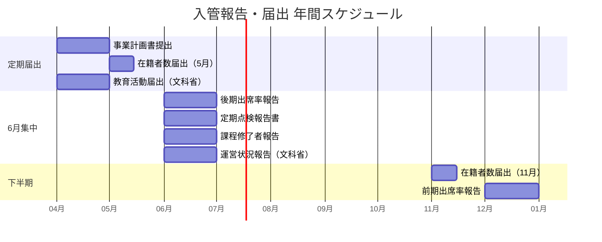
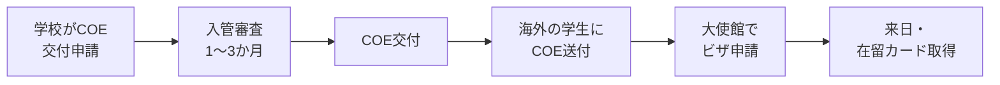

# 業務フロー — 入管報告・届出

## 都度発生する報告・届出

学生の退学・出席不良・受入れの開始終了など、イベント発生時に速やかに届出が必要なものです。

| 報告・届出 | タイミング | 根拠 | 届出方法 |
|-----------|-----------|------|----------|
| 退学者の報告 | 退学月の翌月末まで | 告示基準第38号 | 電子届出システム / 書面 |
| 出席率5割未満の報告 | 該当月の翌月末まで | 告示基準第37号 | 電子届出システム / 書面 |
| 受入れ開始の届出 | 開始から14日以内 | 入管法第19条の17 | 電子届出システム / 窓口 / 郵送 |
| 受入れ終了（離脱）の届出 | 終了から14日以内 | 入管法第19条の17 | 電子届出システム / 窓口 / 郵送 |
| 所在不明者の報告 | 除籍処分後速やかに | 告示基準 / 入管法第19条の17 | 電子届出システム / 書面 |
| 各種変更届出 | 変更前または変更後速やかに | 告示基準第42号 | 書面（管轄入管に確認） |

### 退学者・所在不明者報告の詳細フロー

::: tip 所在不明者の対応
まず本国の家族、同級生、アルバイト先等から情報収集を行い、所在把握に努めてください。所在が把握できない場合は除籍処分とした上で入管に届出します。
:::

## 定期的な報告・届出

年間スケジュールに基づき、決まった時期に提出する報告・届出です。

| 報告・届出 | 期限 | 根拠 | 届出方法 |
|-----------|------|------|----------|
| 在籍者数に関する届出 | 5月1日〜14日、11月1日〜14日 | 入管法第19条の17 | 電子届出システム |
| 6か月出席率報告（前期） | 12月末まで（4月〜9月分） | 告示基準第35号 | 電子届出システム / 書面 |
| 6か月出席率報告（後期） | 6月末まで（10月〜3月分） | 告示基準第35号 | 電子届出システム / 書面 |
| 定期点検報告書 | 毎年6月末まで | 告示基準第45号 | 電子届出システム / 書面 |
| 課程修了者の報告 | 修業期間終了後の翌年度6月末まで | 告示基準第44号 | 電子届出システム / 書面 |
| 運営状況に関する報告書 | 毎年度6月末まで | 認定法 施行規則第28条 | 文科省に提出 |
| 所在地以外の場所での教育活動届出 | 毎年度4月末まで | 認定法 施行規則第30条 | 文科省に提出 |
| 事業計画書の提出 | 翌年度分を毎年提出 | 告示基準第43号 | 書面 |

### 年間報告スケジュール

::: warning 6月末は報告集中月
6月末には「定期点検報告書」「6か月出席率報告（後期）」「課程修了者の報告」「運営状況に関する報告書（文科省）」が同時に期限を迎えます。準備は5月から開始してください。
:::

## 定期点検報告書の詳細（告示基準第45号）

毎年4月1日時点での告示基準への適合性を自己点検し、6月末までに報告します。

| 項目 | 内容 |
|------|------|
| 対象 | 告示基準第1号〜第48号のすべてへの適合性 |
| 時点 | 毎年4月1日時点 |
| 期限 | 6月末まで |
| 提出先 | 管轄の地方出入国在留管理局 |
| 頻度 | 原則毎年（3年連続適正校は3年ごと） |
| 資料保存 | 確認に用いた資料は3年間保存 |
| 書式 | 入管庁サイトで参考様式（PDF・Excel）を公開 |

## 課程修了者の報告（告示基準第44号）

| 項目 | 内容 |
|------|------|
| 報告内容 | 課程修了者のうち、以下の合計が修了者の7割以上であること |
| | (1) 大学等への進学者 |
| | (2) 在留資格変更を許可された者 |
| | (3) CEFR A2相当以上の日本語能力を証明された者 |
| 期限 | 修業期間の終期の翌年度6月末まで |
| 提出先 | 管轄の地方出入国在留管理局 |
| 公表義務 | 結果を公表する義務あり |

::: danger 注意
3年連続で7割を下回ると告示抹消の対象になります。
:::

## 変更届出（告示基準第42号）

以下の事項に変更が生じた場合、変更前または変更後速やかに届出が必要です。

| No. | 変更事項 |
|-----|---------|
| 1 | 設置者の名称または住所 |
| 2 | 設置者が法人の場合、代表者の氏名 |
| 3 | 設置者が法人の場合、役員の氏名 |
| 4 | 校長の氏名 |
| 5 | 教員の氏名及び担当科目 |
| 6 | 事務局の組織（名称・人員） |
| 7 | 日本語教育機関の名称 |
| 8 | 日本語教育機関の位置（住所） |
| 9 | 収容定員 |
| 10 | 教育課程（カリキュラム） |
| 11 | 入学時期（4月入学、10月入学など） |
| 12 | 修業期間（1年、1年6か月、2年） |
| 13 | 授業時間数 |
| 14 | 授業科目 |
| 15 | 校舎・教室・その他施設 |
| 16 | 学則 |
| 17 | 校舎等の図面 |

::: info 2025年5月改正
認定制度に合わせて、教育課程の変更届出ではより詳細な記載（CAN-DO記述文等）が新たに求められています。
:::

## 報告を怠った場合のリスク

| リスク | 詳細 |
|--------|------|
| 適正校認定の取消し | 報告義務違反は適正校認定の審査でマイナス評価。最悪の場合は取消し |
| 在留資格審査の厳格化 | 適正校でなくなるとCOE交付審査が厳格化され、必要書類が大幅に増加。在留期間も2年→6か月に |
| 告示抹消 | 重大な違反や改善が見られない場合、告示自体が抹消される |

## 電子届出システム（i-ENS）

入国管理局への届出は、出入国在留管理庁電子届出システム（i-ENS）を利用して行えます。

### 対象となる届出

- 入管法第19条の17に基づく届出（受入れ開始・離脱）
- 告示基準に基づく各種報告（退学者報告、出席率報告、定期点検報告、課程修了者報告）

### 利用登録の手順

1. 利用者情報登録届出書を作成
2. 管轄の地方出入国在留管理局に窓口又は郵送で提出
3. 職員であることを確認する書類を提示（職員証、在留カード、健康保険証等）
4. ID・パスワードが発行される
5. 電子届出システムにログインして届出

### システムの特徴

| 項目 | 内容 |
|------|------|
| 利用時間 | 24時間365日 |
| 手数料 | 無料 |
| 届出履歴 | 確認可能 |
| 留学生の届出 | 1人でもExcelファイルでの届出が必要 |
| 注意 | 氏名・国籍等の身分事項変更は電子届出不可 |

### 届出に必要な情報

| 項目 |
|------|
| 氏名 |
| 生年月日 |
| 性別 |
| 国籍・地域 |
| 住居地 |
| 在留カード番号 |
| 受入れの開始・終了に関する事項 |

## 在留資格認定証明書（COE）申請

### 申請の流れ

### 必要書類（適正校の場合）

| 書類 |
|------|
| 在留資格認定証明書交付申請書 |
| 写真（規定サイズ） |
| 返信用封筒（404円分の切手） |
| 提出書類一覧表 |
| パスポート身分事項ページの写し |

### 追加書類（非適正校の場合）

| 書類 |
|------|
| 最終学校の卒業証明書 |
| 日本語能力証明書 |
| 経費支弁書 |
| 経費支弁者と申請人の関係証明 |
| 預金残高証明書（原本） |
| 過去3年間の資金形成経緯資料 |

::: tip COEの電子化
2023年3月17日よりCOEの電子化が開始されています。
:::

## 在留期間更新許可申請

### 必要書類

| 書類 | 備考 |
|------|------|
| 在留期間更新許可申請書（申請者用） | 入管庁HPからダウンロード |
| 在留期間更新許可申請書（学校用） | 学校事務が作成 |
| 写真（3cm x 4cm） | |
| パスポート・在留カード | 申請時に提示 |
| 在学証明書 | 学校事務が発行 |
| 成績証明書 | 学校事務が発行 |
| 滞在費支弁書 | |

### 出席率と更新の関係

| 出席率 | 影響 |
|--------|------|
| 80%以上 | 問題なし |
| 70〜80%未満 | 理由書・疎明資料が追加で必要 |
| 70%未満 | 原則更新不許可 |

### その他

| 項目 | 内容 |
|------|------|
| 申請時期 | 在留期間満了日の3か月前から |
| 手数料 | 窓口6,000円、オンライン5,500円 |
| 審査期間 | 2週間〜3か月 |
| 在籍可能期間 | 最長2年間 |

::: danger 重要
在留期間を1日でも超過すると不法滞在になります。
:::

## 記録の保存義務

| 対象 | 保存期間 | 根拠 |
|------|----------|------|
| 出欠記録 | 在籍終了後 少なくとも**1年間** | 告示基準第46号 |
| 出席率8割未満の指導記録 | 在籍終了後 少なくとも**1年間** | 告示基準第36号・第46号 |
| アルバイト先の届出記録 | 在籍終了後 少なくとも**1年間** | 告示基準第40号 |
| 入学選考に関する記録 | 選考実施日から少なくとも**3年間** | 告示基準第34号 |
| 定期点検の確認資料 | **3年間** | 告示基準第45号 |
| 学費の徴収・支出に関する帳簿 | 作成後**5年間** | 告示基準第6号 |

::: warning 入学選考記録は3年保存
入学選考記録は他の在籍管理記録（1年保存）と異なり、**3年間**の保存が義務付けられています（告示基準第34号）。混同しないよう注意してください。
:::

## 参考リンク

- [告示基準に基づく各種報告（入管庁）](https://www.moj.go.jp/isa/applications/resources/nyuukokukanri07_00218.html)
- [中長期在留者の受入れに関する届出（入管庁）](https://www.moj.go.jp/isa/applications/procedures/nyuukokukanri10_00017.html)
- [電子届出システムポータル（入管庁）](https://www.moj.go.jp/isa/applications/online/i-ens_index.html)
- [在留資格認定証明書交付申請（入管庁）](https://www.moj.go.jp/isa/applications/procedures/16-1.html)
- [在留期間更新許可申請（入管庁）](https://www.moj.go.jp/isa/applications/procedures/16-3.html)
- [適正校認定の基準（入管庁）](https://www.moj.go.jp/isa/applications/resources/nyuukokukanri07_00024.html)
