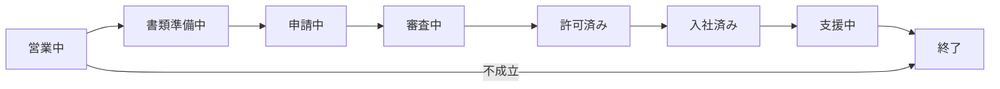
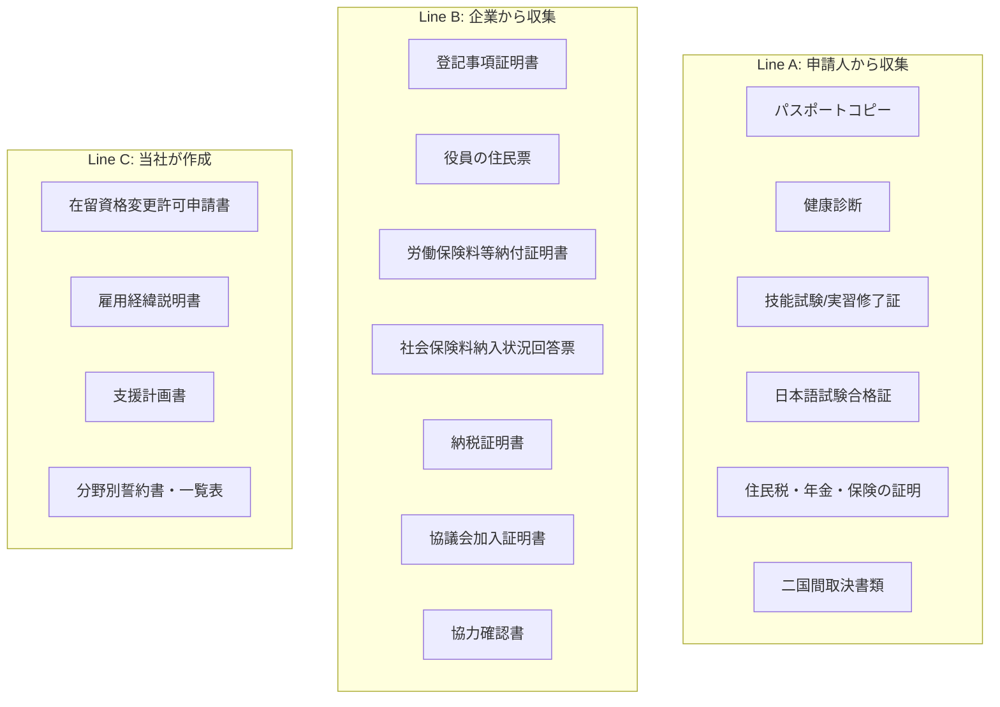
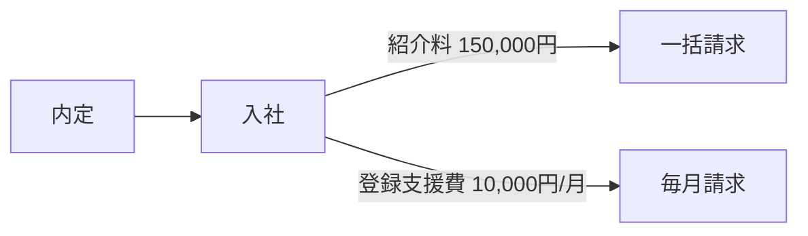

# 業務フロー — 特定技能の案件ライフサイクル

## 全体像

特定技能の業務は、営業から支援終了まで8つのステータスで管理する。

| ステータス | 意味 | 次へ進むトリガー |
|---|---|---|
| 営業中 | 企業と候補者のマッチング段階 | 内定確定 |
| 書類準備中 | 申請書類を準備中 | 書類が揃う |
| 申請中 | 入管に申請書類を提出済み | 入管受理 |
| 審査中 | 入管が審査中 | 許可通知受領 |
| 許可済み | 在留資格変更が許可された | 入社日到来 |
| 入社済み | 受入れ企業に入社した | 支援開始 |
| 支援中 | 義務的支援を実施中 | 退職/帰国/期間満了 |
| 終了 | 支援終了 | — |

## 1. 営業フェーズ

営業担当が受入れ企業を開拓し、マッチングを行う。

| ステップ | 内容 | 担当 |
|---|---|---|
| 1. 企業開拓 | 受入れ企業の新規開拓・既存顧客への提案 | 営業 |
| 2. ニーズヒアリング | 分野・人数・時期を確認 | 営業 |
| 3. 候補者選定 | 常南国際学院の卒業生から候補者を選定 | 支援責任者 |
| 4. 面談設定 | 企業と候補者の面談を設定 | 営業・支援責任者 |
| 5. 内定 | 内定確定 → ステータスを「書類準備中」へ | 営業 |

::: tip 対象者
職業紹介の対象は**常南国際学院の卒業生限定**。紹介料は150,000円/名（一律）。
:::

## 2. 書類準備フェーズ

内定後、3つのラインを並行して進める。所要期間の目安は約4〜8週間。

### 2-1. 契約の締結

内定確定後、まず2本の契約を締結する。

| 契約 | 内容 | 金額 |
|---|---|---|
| 支援委託契約 | 義務的支援10項目の実施を全部受託 | 10,000円/月/名 |
| 職業紹介契約 | 常南国際学院卒業生の職業紹介 | 150,000円/名 |

### 2-2. 書類収集・作成（3ライン並行）

| ライン | 所要期間 | ボトルネック |
|---|---|---|
| Line A: 申請人書類 | 2〜4週間 | 健康診断の予約・結果待ち |
| Line B: 企業書類 | 2〜3週間 | 納税証明書の発行待ち |
| Line C: 作成書類 | 1〜2週間 | 学生DBからの自動入力で短縮可 |
| 全体とりまとめ | 1週間 | 最終チェック・不備修正 |

::: info 書類の詳細
各書類のIDと分類は [データ定義](./02-data.md) を参照。
:::

## 3. 申請・審査フェーズ

| ステップ | 内容 | 所要期間 |
|---|---|---|
| 1. 申請提出 | 入管に在留資格変更許可申請を提出 | 1日 |
| 2. 審査 | 入管で審査。追加資料の要求があれば対応 | 1〜3ヶ月 |
| 3. 許可通知 | 結果通知を受領 | — |

::: warning 追加資料対応
審査中に入管から追加資料の要求が来ることがある。速やかに対応しないと審査が長引く。
:::

## 4. 入社・支援開始フェーズ

許可後、以下の手続きを経て入社・支援開始となる。

| ステップ | 内容 | 担当 |
|---|---|---|
| 1. 在留カード受取 | 入管窓口で在留カードを交付 | 支援責任者・本人 |
| 2. 住居確保支援 | 住居の契約手続き支援 | 支援責任者 |
| 3. 生活オリエンテーション | 日本のルール・マナー、交通、医療、防災等の説明 | 支援責任者 |
| 4. 公的手続き同行 | 市区町村届出、社会保険、税金等 | 支援責任者 |
| 5. 入社 | 受入れ企業に入社 | — |

## 5. 支援・運用フェーズ

入社後は義務的支援10項目を継続的に実施する。

### 義務的支援10項目

| # | 支援項目 | タイミング |
|---|---|---|
| 1 | 事前ガイダンス | 入国前 |
| 2 | 出入国する際の送迎 | 入国時/帰国時 |
| 3 | 住居確保・生活に必要な契約支援 | 入国直後 |
| 4 | 生活オリエンテーション | 入国直後 |
| 5 | 公的手続等への同行 | 入国直後〜 |
| 6 | 日本語学習の機会の提供 | 継続的 |
| 7 | 相談・苦情への対応 | 継続的 |
| 8 | 日本人との交流促進 | 継続的 |
| 9 | 転職支援（非自発的離職時） | 離職時 |
| 10 | 定期的な面談・行政機関への通報 | 四半期（3ヶ月に1回以上） |

### 入管への届出・報告

| 届出種別 | 頻度 | 届出者 |
|---|---|---|
| 年次の定期届出 | 年1回（4〜5月） | 受入れ企業（所属機関） |
| 随時届出 | 事由発生から14日以内 | 受入れ企業 or 登録支援機関 |
| 特異事案報告 | 発生の都度、速やかに | 登録支援機関 |
| 活動未実施届出 | 該当時、速やかに | 受入れ企業 |

::: info 2025年4月の制度改正
定期届出は四半期から年1回に変更。届出主体は所属機関に一本化。初回は2026年4〜5月。
:::

### 社内の月次報告

- 月次報告書を笹目会長に提出
- 案件管理台帳の更新

## 6. 終了フェーズ

以下のいずれかで支援が終了する。

| 終了事由 | 備考 |
|---|---|
| 在留期間満了 | 通算5年が上限（1号の場合） |
| 2号への移行 | 当社は2号を扱わないため支援終了 |
| 自発的退職 | — |
| 非自発的離職 | **転職支援義務あり**（義務的支援の第9項） |
| 帰国 | — |

## 収益の発生タイミング

| タイミング | 品目 | 金額 | 請求先 |
|---|---|---|---|
| 入社確定時 | 職業紹介手数料 | 150,000円/名 | 受入れ企業 |
| 毎月 | 登録支援費 | 10,000円/名/月 | 受入れ企業 |

- 消費税：外税（別途10%）
- 振込先：足利銀行 つくば支店 普通 5033625
