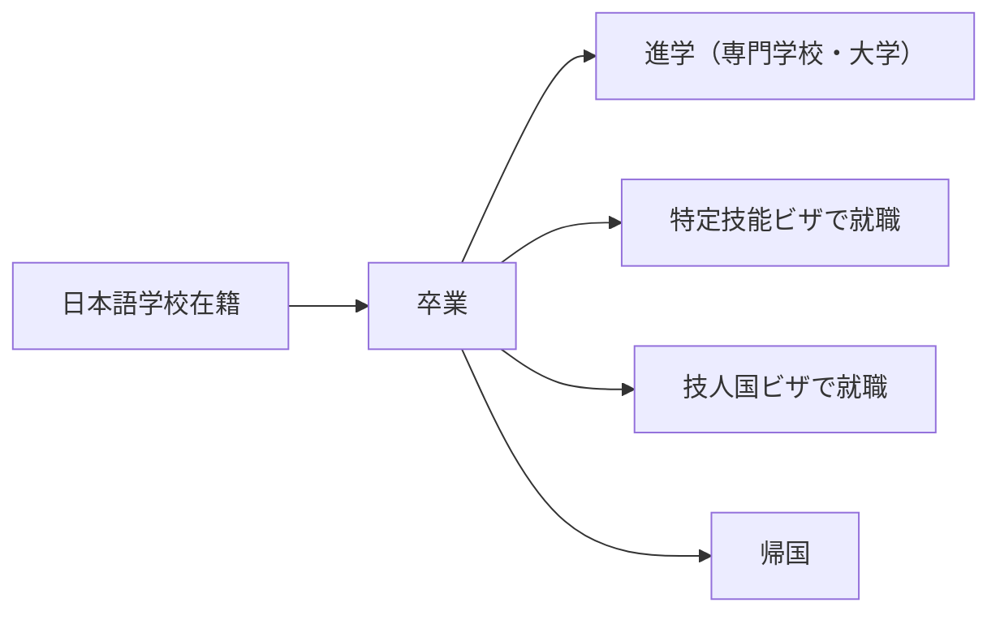

# 特定技能・職業紹介

日本語学校の卒業生や在籍者に対する特定技能ビザへの移行・職業紹介に関するカテゴリです。

::: info ステータス
本セクションは概要のみ。詳細は今後追記予定。
:::

## コンセプト

日本語学校の学生データベースは、特定技能の業務と根本的に重複する部分がある。

- 学生の基本情報（氏名・国籍・在留資格・日本語レベル等）
- 経歴・資格情報
- エージェント情報

**設計方針**: 学生データを一度正確に入力すれば、そのデータ基盤を使って特定技能の業務にも拡張できる状態を目指す。留学生管理と特定技能管理でデータの二重入力が発生しない設計が理想。

## 日本語学校との関連

### 学生のキャリアパス上の位置づけ

日本語学校の卒業後の進路として、特定技能ビザでの就職は主要な選択肢のひとつ。

### データ基盤の共通化

特定技能の業務を行う際にも、日本語学校で蓄積した以下のデータが活用できる：

| データ | 留学生管理での用途 | 特定技能での用途 |
|--------|------------------|----------------|
| 基本情報（氏名・国籍等） | 在籍管理 | 支援計画書の作成 |
| 日本語レベル | 授業レベル分け | 就職マッチング |
| 在留資格情報 | ビザ更新管理 | 在留資格変更申請 |
| 経費支弁者情報 | 入管申請 | — |
| エージェント情報 | 募集管理 | 送出機関連携 |

## 関連カテゴリ

- [02 学生管理](/01-domain-knowledge/02-student-management/) — 学生のライフサイクル・進路
- [07 エージェント管理](/01-domain-knowledge/07-agent-management/) — 送出機関との関係
- [11 入管報告・届出](/01-domain-knowledge/11-immigration-report/) — 在留資格の変更手続き
