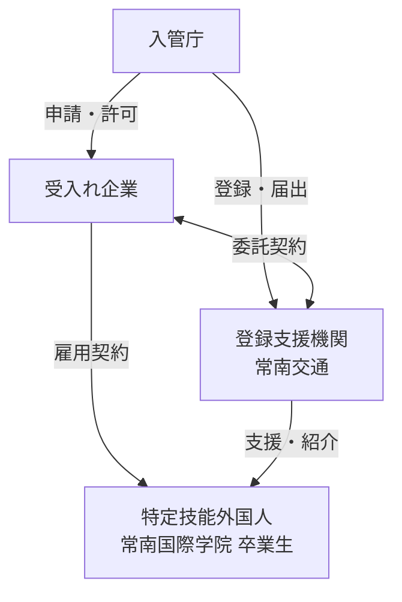
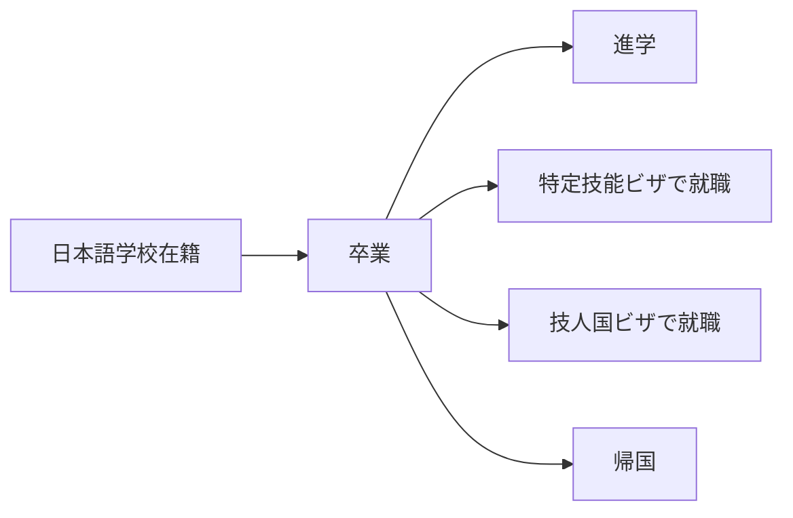

# 特定技能・職業紹介

常南国際学院の卒業生に対する特定技能ビザへの移行・職業紹介・義務的支援に関するカテゴリ。

## 概要

### 特定技能制度とは

2019年4月に新設された在留資格。人手不足が深刻な産業分野で、即戦力の外国人労働者を受け入れるための制度。従来の「技能実習」が"技術移転による国際貢献"を建前としていたのに対し、特定技能は"労働力の確保"を正面から認めた点が異なる。

### 1号と2号

| | 特定技能1号 | 特定技能2号 |
|---|---|---|
| 対象 | 相当程度の知識・経験を要する業務 | 熟練した技能を要する業務 |
| 在留期間 | 通算5年まで | 上限なし |
| 家族帯同 | 不可 | 可 |
| 支援計画 | 必要 | 不要 |
| 日本語要件 | N4以上 | 分野別の上位試験 |

::: warning 当社の対象範囲
当社（常南交通/常南国際学院）が扱うのは **1号のみ**。2号は現時点で対象外。
:::

### 当社の2つの役割

常南交通株式会社は以下の2つの役割を持つ。

| 役割 | 許可番号 | 内容 | 料金 |
|---|---|---|---|
| 登録支援機関 | 19登-001334 | 義務的支援10項目の全部受託 | 10,000円/月/名 |
| 有料職業紹介事業者 | （許可番号要確認） | 常南国際学院卒業生の紹介 | 150,000円/名 |

### 紹介実績のある分野（5分野）

| 分野 | 主な受入れ企業 | 協議会加入 |
|---|---|---|
| 介護 | サンテーヌ土浦 等 | 加入済み |
| 宿泊 | TSUKUBAリゾート | 加入済み |
| 外食業 | 株式会社梅屋 | 加入済み |
| 飲食料品製造業 | 丸千代山岡家 | 加入済み |
| 自動車運送業 | 常南交通本体 | 加入済み |

### 社内体制

| 役割 | 担当者 | 備考 |
|---|---|---|
| 代表者 | 笹目博 | 登録支援機関の届出名義 |
| 支援責任者 | 笹目瑛司 | 支援計画の実施責任者（1名体制） |
| 報告先 | 笹目会長 | 月次報告書の宛先 |
| 営業 | 別担当 | 受入れ企業への提案 |

### ステークホルダーの関係

## 日本語学校との関連

### 学生のキャリアパス上の位置づけ

卒業後の進路として、特定技能ビザでの就職は主要な選択肢のひとつ。

### データ基盤の共通化

特定技能の業務で必要なデータの多くは、学生管理で既に保持しているデータと重複する。

| データ | 留学生管理での用途 | 特定技能での用途 |
|--------|------------------|----------------|
| 基本情報（氏名・国籍等） | 在籍管理 | 支援計画書・申請書の作成 |
| 日本語レベル | 授業レベル分け | 就職マッチング・試験免除判定 |
| 在留資格情報 | ビザ更新管理 | 在留資格変更申請 |
| パスポート情報 | 入管申請 | 在留資格変更申請 |
| エージェント情報 | 募集管理 | 送出機関連携 |

## このカテゴリのファイル

- [業務フロー](./01-work-flow.md) — 案件のライフサイクル（営業〜支援終了の8ステータス）
- [データ定義](./02-data.md) — 案件・企業・申請書類・証憑書類のデータ構造
- [課題](./03-issues.md) — 現状の課題とシステム化の方向性

## 関連カテゴリ

- [02 学生管理](/01-domain-knowledge/02-student-management/) — 学生データの共通基盤
- [07 エージェント管理](/01-domain-knowledge/07-agent-management/) — 送出機関との関係
- [11 入管報告・届出](/01-domain-knowledge/11-immigration-report/) — 在留資格の変更手続き
- [14 募集・入学手続き](/01-domain-knowledge/14-recruitment/) — 学生募集との連携
