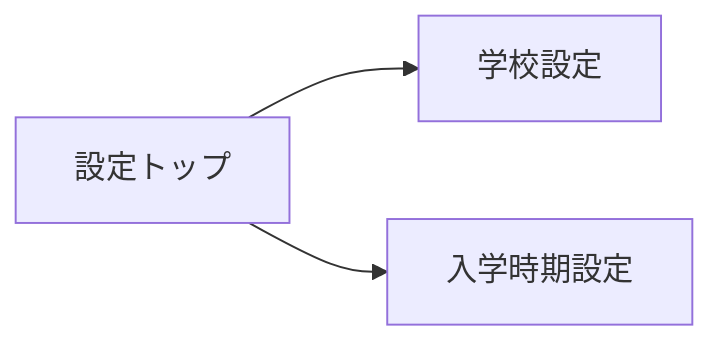

# 学校基本情報 UIUX定義

学校基本情報はマスタデータ管理の位置づけ。頻繁に更新するものではなく、管理者のみが操作する設定画面として設計する。

## 操作フロー

### 画面一覧

| 画面名 | パス | 役割 |
|--------|------|------|
| 学校設定 | /settings/school | 学校マスタの閲覧・編集 |
| 入学時期設定 | /settings/enrollment-periods | 入学時期の一覧・登録・編集 |

### 画面遷移

## 画面定義

### 学校設定

#### 表示内容

- 参照エンティティ: School
  - 表示プロパティ: name, schoolCode, address, phone, corporateName, corporateType, accreditationClass, notificationNumber, capacity, establishedDate
- カード形式で各項目を一覧表示
- 編集ボタンで編集モードに切り替え

#### 編集

- インライン編集（編集ボタン → 各フィールドが入力可能になる → 保存ボタン）
- 学校番号（schoolCode）は原則編集不可。変更が必要な場合は特別な操作フローを用意

#### アクセス権限

- 閲覧: 全ユーザー
- 編集: 管理者のみ

#### フォーム内容

| フィールド | 型 | 必須 | バリデーション | 備考 |
|-----------|-----|------|---------------|------|
| 学校名 | text | o | 1文字以上 | |
| 学校番号 | text | o | 3桁の半角数字 | 原則編集不可 |
| 所在地 | text | o | 1文字以上 | |
| 電話番号 | tel | - | 電話番号形式 | |
| 運営法人名 | text | o | 1文字以上 | |
| 法人種別 | select | o | CorporateType Enum | |
| 適正校分類 | select | o | AccreditationClass Enum | |
| 告示番号 | text | - | | |
| 定員数 | number | o | 正の整数 | |
| 設立年月日 | date | o | 過去の日付 | |

---

### 入学時期設定

#### 表示内容

- 参照エンティティ: EnrollmentPeriod
  - 表示プロパティ: fiscalYear, enrollmentMonth, durationMonths, recruitmentCapacity
- テーブル形式で年度×入学月の一覧を表示
- フィルタ: 年度
- ソート: 年度降順 → 入学月順（デフォルト）

#### アクション

| アクション | 遷移先 | 条件 |
|-----------|--------|------|
| 新規登録ボタン | 入学時期登録ダイアログ | 管理者のみ |
| 行クリック | 入学時期編集ダイアログ | 管理者のみ |

#### フォーム内容（登録・編集共通）

| フィールド | 型 | 必須 | バリデーション | 備考 |
|-----------|-----|------|---------------|------|
| 年度 | number | o | 4桁の西暦 | |
| 入学月 | select | o | EnrollmentMonth Enum | |
| 在籍期間（月数） | number | o | 正の整数 | 入学月選択時に自動設定（編集不可） |
| 募集定員 | number | o | 正の整数 | |

- 在籍期間は入学月の選択に連動して自動設定される（4月→24、10月→18、1月→15、7月→21）。手動変更は不可
- 同一学校・年度・入学月の組み合わせが重複する場合はエラー

## アルゴリズム

### 在籍期間の自動設定

- 利用箇所: 入学時期登録・編集フォーム
- 処理内容:
  1. ユーザーが入学月（EnrollmentMonth）を選択
  2. 以下のマッピングに基づき在籍期間を自動設定:
     - APRIL → 24ヶ月
     - OCTOBER → 18ヶ月
     - JANUARY → 15ヶ月
     - JULY → 21ヶ月
  3. 自動設定された値は編集不可（学校レベルではイレギュラーな在籍期間は発生しない）
- 副作用: なし
