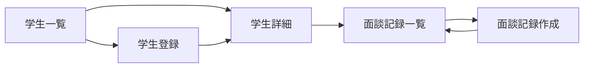

# 学生管理 UIUX定義

## 操作フロー

### 画面一覧

| 画面名 | パス | 役割 |
|--------|------|------|
| 学生一覧 | /students | 全学生の一覧表示・検索・フィルタ |
| 学生詳細 | /students/:id | 学生の全情報表示・編集 |
| 学生登録 | /students/new | 新規学生の登録 |
| 面談記録一覧 | /students/:id/interviews | 学生ごとの面談記録一覧 |
| 面談記録作成 | /students/:id/interviews/new | 面談記録の新規作成 |

### 画面遷移

## 画面定義

### 学生一覧

#### 表示内容

- 参照エンティティ: Student
  - 表示プロパティ: studentNumber, nameKanji, nameEn, nationality, status, cohort, 現在のクラス名（ClassEnrollment経由）
- フィルタ:
  - ステータス（StudentStatus）
  - コホート（Cohort）
  - 国籍
  - クラス
- ソート: 学籍番号（デフォルト昇順）
- ページネーション: あり（50件/ページ）
- 検索: 氏名（漢字/英語）・学籍番号で部分一致検索

#### アクション

| アクション | 遷移先 | 条件 |
|-----------|--------|------|
| 行クリック | 学生詳細 | - |
| 新規登録ボタン | 学生登録 | - |

---

### 学生詳細

#### 表示内容

- 参照エンティティ: Student, StudentEmployment, InterviewRecord
- タブ構成:

| タブ | 表示内容 |
|------|---------|
| 基本情報 | 氏名、生年月日、性別、国籍、連絡先、住所 |
| 学籍情報 | 学籍番号、ステータス、コホート、現在のクラス（ClassEnrollment経由）、入学日、卒業予定日 |
| 在留情報 | パスポート、在留カード、在留資格、在留期限、資格外活動許可 |
| 入国情報 | 入国日、入国空港、便名、出迎え担当 |
| 勤務先 | 勤務先一覧（最大3件）、週合計勤務時間 |
| 進路 | 進路区分、進路先名、合否 |
| 面談記録 | 面談記録一覧（直近5件）→ 全件表示へのリンク |

#### 編集

- 各タブ内で直接編集可能（インライン編集）
- 保護対象プロパティ（withdrawalDate, agentId）は編集不可。変更が必要な場合は管理者権限で別フローを用意

#### ステータス変更

- ステータス変更は専用のアクションボタンで実行
- 許可される遷移:

| 現在のステータス | 変更可能なステータス |
|----------------|-------------------|
| 入学前 | 在学 |
| 在学 | 休学、退学、除籍、卒業、修了 |
| 休学 | 在学、退学、除籍 |

- 退学・除籍への遷移時は理由の入力を必須とする
- ステータス変更時は確認ダイアログを表示

---

### 学生登録

#### フォーム内容

| フィールド | 型 | 必須 | バリデーション | 備考 |
|-----------|-----|------|---------------|------|
| 氏名（英語） | text | o | 1文字以上 | パスポート記載名 |
| 氏名（漢字） | text | - | | 漢字圏のみ |
| 氏名（カナ） | text | - | | |
| 生年月日 | date | o | 過去の日付 | |
| 性別 | select | o | Gender Enum | |
| 国籍 | select | o | | |
| コホート | select | o | Cohort Enum | |
| エージェント | select | - | Agent一覧から選択 | |
| メールアドレス | email | - | メール形式 | |
| 電話番号 | tel | - | | |

- 学籍番号は入学年＋コホート＋連番から自動採番
- 送信後の遷移: 学生詳細画面
- 初期ステータス: PRE_ENROLLMENT（入学前詳細: APPLICATION_PLANNED）

---

### 面談記録一覧

#### 表示内容

- 参照エンティティ: InterviewRecord
  - 表示プロパティ: interviewDate, interviewType, staffName, content（先頭50文字）
- フィルタ: 面談種別（InterviewType）
- ソート: 面談日（デフォルト降順）
- ページネーション: あり（20件/ページ）

#### アクション

| アクション | 遷移先 |
|-----------|--------|
| 新規作成ボタン | 面談記録作成 |
| 行クリック | 面談記録詳細（モーダル） |

---

### 面談記録作成

#### フォーム内容

| フィールド | 型 | 必須 | バリデーション | 備考 |
|-----------|-----|------|---------------|------|
| 面談日 | date | o | 過去〜本日 | デフォルト: 本日 |
| 面談種別 | select | o | InterviewType Enum | |
| 内容 | textarea | o | 1文字以上 | |
| アクション項目 | textarea | - | | 面談後の対応事項 |

- 送信後の遷移: 面談記録一覧
- 担当者はログインユーザーを自動設定

## アルゴリズム

### 学籍番号の自動採番

- 利用箇所: 学生登録フォーム送信時
- 処理内容:
  1. 入学年（西暦下2桁）を取得
  2. コホートコード（04=4月, 07=7月, 10=10月, 01=1月）を設定
  3. 同一入学年・コホートの既存学生数 + 1 を連番（3桁ゼロ埋め）とする
  4. `{入学年}{コホートコード}{連番}` を結合
- 例: 2025年4月生の6人目 → `2504006`

### 在留期限アラート

- 利用箇所: ダッシュボード、学生一覧
- 処理内容:
  1. 全在学生の residenceExpiry を日次でスキャン
  2. 期限の3ヶ月前・2ヶ月前・1ヶ月前にアラートを生成
  3. アラートはダッシュボードと学生一覧のバッジで表示
- 副作用: なし（読み取り専用）

### 週間勤務時間チェック

- 利用箇所: 勤務先情報の登録・更新時
- 処理内容:
  1. 対象学生の全 StudentEmployment の weeklyHours を合計
  2. 合計が 28時間を超える場合、警告を表示（登録自体はブロックしない）
- 副作用: なし
