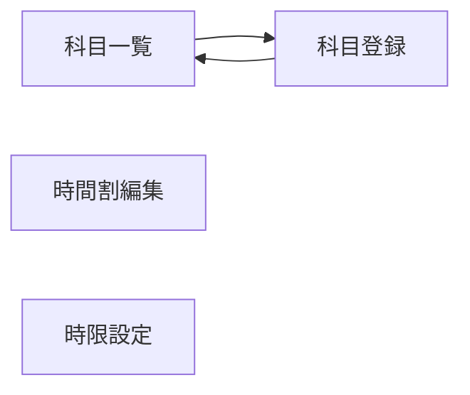

# カリキュラム・時間割 UIUX定義

## 操作フロー

### 画面一覧

| 画面名 | パス | 役割 |
|--------|------|------|
| 科目一覧 | /curriculum/subjects | 科目マスタの一覧表示・管理 |
| 科目登録 | /curriculum/subjects/new | 新規科目の登録 |
| 時間割編集 | /curriculum/timetable | クラス×曜日×時限のグリッド入力 |
| 時限設定 | /settings/periods | 時限マスタの管理 |

### 画面遷移

## 画面定義

### 科目一覧

#### 表示内容

- 参照エンティティ: Subject
  - 表示プロパティ: name, category, targetLevel, isActive
- フィルタ:
  - カテゴリ（SubjectCategory）
  - 対象レベル（JlptLevel）
  - 有効/無効
- ソート: 科目名（デフォルト昇順）
- ページネーション: あり（20件/ページ）

#### アクション

| アクション | 遷移先 | 条件 |
|-----------|--------|------|
| 行クリック | 科目編集（モーダル） | - |
| 新規登録ボタン | 科目登録 | - |

---

### 科目登録

#### フォーム内容

| フィールド | 型 | 必須 | バリデーション | 備考 |
|-----------|-----|------|---------------|------|
| 科目名 | text | o | 1文字以上 | |
| カテゴリ | select | o | SubjectCategory Enum | |
| 対象レベル | select | - | JlptLevel Enum | 省略可 |
| 説明 | textarea | - | | |

- 送信後の遷移: 科目一覧画面

---

### 時間割編集

時間割管理のメイン画面。クラスを選択し、曜日×時限のグリッドで科目・教員をアサインする。

#### 操作フロー

1. 年度・学期を選択
2. クラスを選択（A1〜A4、P1〜P3）
3. 曜日×時限のグリッドが表示される
4. 各セルをクリックして科目・担当教員を設定

#### 表示内容

- 参照エンティティ: TimetableSlot, Period, Subject, Staff
- レイアウト: グリッド形式
  - 行: 時限（Period）
  - 列: 曜日（月〜土、日曜は非表示がデフォルト）
  - セル内容: 科目名 + 担当教員名
- 上部コントロール:
  - 年度セレクタ
  - 学期セレクタ（前期/後期）
  - クラスセレクタ

#### セル編集

| フィールド | 型 | 必須 | バリデーション | 備考 |
|-----------|-----|------|---------------|------|
| 科目 | select | o | Subject一覧から選択 | 有効な科目のみ表示 |
| 担当教員 | select | - | Staff一覧から選択 | 未定の場合は空欄可 |

- セルクリックでポップオーバー編集
- 空セルクリックで新規割当
- 既存セルクリックで変更・削除

#### ビジネスルール

- 同一クラス・同一曜日・同一時限には1つの科目のみ割当可能
- 同一教員が同一曜日・同一時限に複数クラスを担当する場合は警告を表示

---

### 時限設定

#### 表示内容

- 参照エンティティ: Period
  - 表示プロパティ: periodNumber, startTime, endTime, timeSlot
- ソート: 時限番号（昇順）

#### フォーム内容

| フィールド | 型 | 必須 | バリデーション | 備考 |
|-----------|-----|------|---------------|------|
| 時限番号 | number | o | 正の整数、重複不可 | |
| 開始時刻 | time | o | HH:mm 形式 | |
| 終了時刻 | time | o | HH:mm 形式、開始時刻より後 | |
| 時間帯区分 | select | o | TimeSlot Enum | |

- インラインで追加・編集・無効化が可能

## アルゴリズム

### 教員重複チェック

- 利用箇所: 時間割編集画面でのセル保存時
- 処理内容:
  1. 保存対象の teacherId, dayOfWeek, periodId, fiscalYear, term を取得
  2. 同一条件で別クラスの TimetableSlot を検索
  3. 該当がある場合、警告メッセージを表示（保存自体はブロックしない）
- 副作用: なし（読み取り専用チェック）

### 週間授業時間の集計

- 利用箇所: 時間割編集画面
- 処理内容:
  1. 指定クラス・年度・学期の全 TimetableSlot を取得
  2. 週あたりの授業コマ数をカウント
  3. 1コマの授業時間（Period の startTime〜endTime）を掛けて週間授業時間を算出
  4. 年間授業週数（38週以上）を掛けて年間授業時間の見込みを表示
- 副作用: なし
