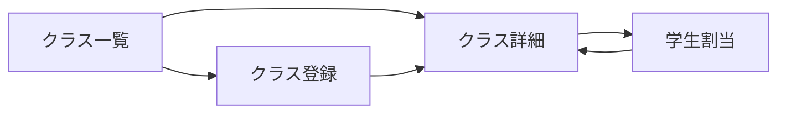

# クラス編成 UIUX定義

## 操作フロー

### 画面一覧

| 画面名 | パス | 役割 |
|--------|------|------|
| クラス一覧 | /classes | 全クラスの一覧表示・フィルタ |
| クラス詳細 | /classes/:id | クラス情報 + 在籍学生一覧 |
| クラス登録 | /classes/new | クラスの新規作成 |
| 学生割当 | /classes/:id/assign | 学生をクラスに割り当て |

### 画面遷移

## 画面定義

### クラス一覧

#### 表示内容

- 参照エンティティ: Class
  - 表示プロパティ: name, jlptLevel, cefrLevel, timeSlot, isSubClass, startDate, endDate, 在籍人数
- フィルタ:
  - 表示条件: 開講中 / 開講予定 / 期間内全て
  - クラスタイプ: すべて / サブクラスなし / サブクラスのみ
- ソート: クラス名 / レベル / 開始日（昇順/降順）
- ページネーション: あり

#### フィルタの挙動

| フィルタ | 条件 |
|---------|------|
| 開講中 | startDate <= 本日 かつ endDate >= 本日 |
| 開講予定 | startDate > 本日 |
| 期間内全て | startDate <= 指定終了日 かつ endDate >= 指定開始日 |
| サブクラスなし | isSubClass = false |
| サブクラスのみ | isSubClass = true |

#### アクション

| アクション | 遷移先 | 条件 |
|-----------|--------|------|
| 行クリック | クラス詳細 | - |
| 新規登録ボタン | クラス登録 | - |

---

### クラス詳細

#### 表示内容

- 参照エンティティ: Class, ClassEnrollment, Student
- セクション構成:

| セクション | 表示内容 |
|-----------|---------|
| クラス情報 | クラス名、印刷用名称、JLPTレベル、CEFRレベル、時間帯区分、サブクラスフラグ、年度、有効期間、最大人数 |
| 在籍学生一覧 | 在籍中の学生リスト（学籍番号、氏名、在籍タイプ、在籍開始日） |

#### 在籍学生一覧

- 表示対象: endDate が null（在籍中）の ClassEnrollment
- 表示プロパティ: studentNumber, nameEn, nameKanji, enrollmentType, startDate
- 在籍人数 / 最大人数のカウント表示（例: 18 / 20）

#### 編集

- クラス情報はインライン編集可能
- maxStudents の変更は、現在の在籍人数を下回る値への変更を不可とする

#### アクション

| アクション | 遷移先 | 条件 |
|-----------|--------|------|
| 学生割当ボタン | 学生割当 | 在籍人数 < maxStudents の場合 |

---

### クラス登録

#### フォーム内容

| フィールド | 型 | 必須 | バリデーション | 備考 |
|-----------|-----|------|---------------|------|
| クラス名 | text | o | 1文字以上 | |
| 印刷用名称 | text | - | | 証明書等に使用 |
| JLPTレベル | select | - | JlptLevel Enum | |
| CEFRレベル | select | - | CefrLevel Enum | |
| 時間帯区分 | select | o | TimeSlot Enum | |
| サブクラスフラグ | checkbox | - | デフォルト: false | |
| 最大人数 | number | o | 1以上、デフォルト: 20 | |
| 年度 | number | o | 西暦4桁 | |
| 開始日 | date | o | | |
| 終了日 | date | o | 開始日より後 | |

- 送信後の遷移: クラス詳細画面

---

### 学生割当

#### 概要

クラスに学生を割り当てる画面。未割当の学生一覧から選択し、在籍タイプを指定してクラスに追加する。

#### フォーム内容

| フィールド | 型 | 必須 | バリデーション | 備考 |
|-----------|-----|------|---------------|------|
| 学生 | select（複数選択可） | o | 在学ステータスの学生のみ | 検索・フィルタ対応 |
| 在籍タイプ | select | o | EnrollmentType Enum | デフォルト: REGULAR |
| 在籍開始日 | date | o | | デフォルト: 本日 |

#### バリデーション

- クラスの在籍人数が maxStudents を超えないこと
- 同一学生が同一クラスに同じ在籍タイプで既に在籍していないこと（unique 制約）
- REGULAR タイプの場合、学生が他のクラスに REGULAR で在籍中でないこと（在籍中 = endDate が null）

#### アクション

- 送信後の遷移: クラス詳細画面
- 割当完了時に ClassEnrollment レコードを作成（endDate = null）
