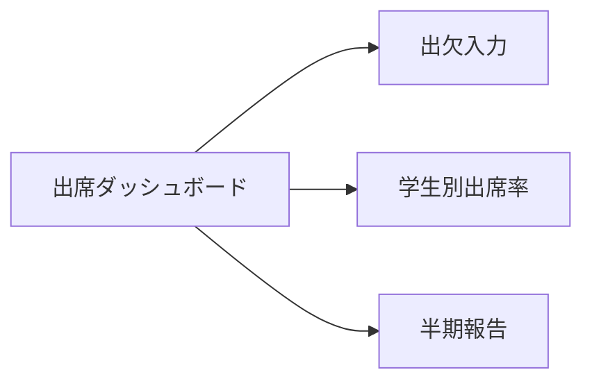

# 出席管理 UIUX定義

## 操作フロー

### 画面一覧

| 画面名 | パス | 役割 |
|--------|------|------|
| 出席ダッシュボード | /attendance | アラート一覧・全体出席率 |
| 出欠入力 | /attendance/input | クラス × 日付の出欠一括入力 |
| 学生別出席率 | /attendance/students/:id | 学生ごとの月次出席率推移 |
| 半期報告 | /attendance/reports | 入管への半期出席率報告管理 |

### 画面遷移

## 画面定義

### 出席ダッシュボード

#### 表示内容

- **アラート一覧**: 出席率80%未満の学生リスト（alertLevel で色分け）
  - 赤: 50%未満（入管報告必要）
  - 黄: 50〜80%未満（指導必要）
- **全体出席率**: 全在学生の当月出席率
- **クラス別出席率**: クラスごとの当月平均出席率

---

### 出欠入力

#### フォーム内容

| フィールド | 型 | 必須 | バリデーション | 備考 |
|-----------|-----|------|---------------|------|
| クラス | select | o | Class 一覧 | A1〜A4, P1〜P3 |
| 日付 | date | o | 過去〜本日 | デフォルト: 本日 |

- クラスと日付を選択すると、所属学生の時限一覧がグリッド表示される
- 各セルに出欠ステータスをドロップダウンで入力
- 「全員出席」ボタンで一括入力可能
- 送信後の遷移: 出席ダッシュボード
- 送信時に MonthlyAttendanceRate を再計算

---

### 学生別出席率

#### 表示内容

- **月次出席率推移グラフ**: 折れ線グラフ（基準ライン80%/50%を破線で表示）
- **月次内訳テーブル**: 月ごとの requiredHours / attendedHours / lateCount / rate
- **アラート表示**: 現在の alertLevel に応じたバッジ

---

### 半期報告

#### 表示内容

- 前期・後期の報告一覧
- 各報告の状態（未提出/提出済み）、期限、全体出席率

#### アクション

| アクション | 処理 |
|-----------|------|
| 報告書生成 | 半期の全学生出席率を集計し、報告データを自動生成 |
| 提出済みにする | reportStatus を SUBMITTED に更新、reportedAt を記録 |

## アルゴリズム

### 月次出席率の算出

- 利用箇所: 出欠入力後の自動計算
- 処理内容:
  1. 対象学生 × 対象月の全 AttendanceRecord を集計
  2. PRESENT + EXCUSED の件数 → attendedHours
  3. 全レコード数（SUSPENDED 除く） → requiredHours
  4. LATE の件数 → lateCount、lateCount / 4（切り捨て） → lateAsAbsence
  5. `rate = (attendedHours - lateAsAbsence) / requiredHours`
  6. rate に基づき alertLevel を判定
- 副作用: MonthlyAttendanceRate の作成/更新

### 出席率アラート判定

- 利用箇所: ダッシュボード表示時、月次出席率算出後
- 処理内容:
  - rate >= 0.8 → NORMAL
  - rate >= 0.5 → GUIDANCE_REQUIRED
  - rate < 0.5 → REPORT_REQUIRED（入管報告が必要）
- 副作用: なし
