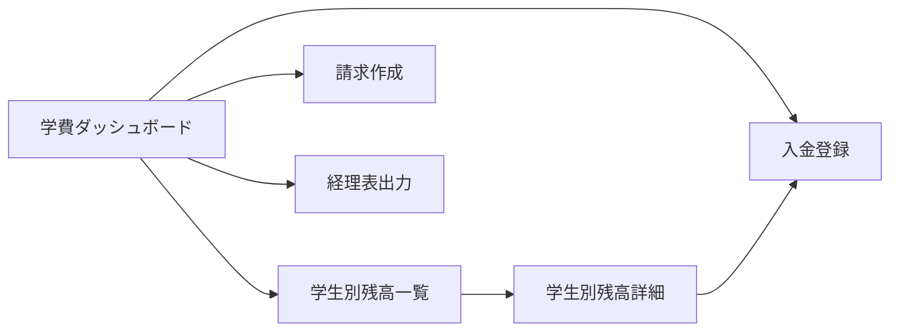

# 学費管理 UIUX定義

## 操作フロー

### 画面一覧

| 画面名 | パス | 役割 |
|--------|------|------|
| 学費ダッシュボード | /tuition | 未収金サマリー・月次売上概要 |
| 学生別残高一覧 | /tuition/balances | 全学生の最新残高一覧 |
| 学生別残高詳細 | /tuition/balances/:studentId | 学生ごとの月次残高推移・請求/入金履歴 |
| 請求作成 | /tuition/invoices/new | 月次一括請求の作成 |
| 入金登録 | /tuition/payments/new | 入金の登録・消込 |
| 経理表出力 | /tuition/reports | 月次経理表の出力 |

### 画面遷移



## 画面定義

### 学費ダッシュボード

#### 表示内容

- **未収金サマリー**: プラス残高の学生数・合計金額
- **過払いサマリー**: マイナス残高の学生数・合計金額
- **当月売上**: ステータスが SETTLED の請求額合計（品目別）
- **直近の入金**: 最新5件の入金レコード

#### アクション

| アクション | 遷移先 |
|-----------|--------|
| 残高一覧 | 学生別残高一覧 |
| 請求作成 | 請求作成 |
| 入金登録 | 入金登録 |
| 経理表出力 | 経理表出力 |

---

### 学生別残高一覧

#### 表示内容

- 参照エンティティ: MonthlyBalance, Student
  - 表示プロパティ: studentNumber, studentName, nationality, cohort, balance, lastPaymentDate
- フィルタ:
  - 残高状態（未収金のみ / 過払いのみ / 全件）
  - コホート
  - 国籍
- ソート: 残高降順（デフォルト）
- ページネーション: あり（50件/ページ）

#### 残高の表示ルール

| 残高の状態 | 表示色 | ラベル |
|-----------|--------|--------|
| プラス（未収金） | 赤 | 未収 |
| ゼロ | 緑 | 正常 |
| マイナス（過払い） | 青 | 過払い |

---

### 学生別残高詳細

#### 表示内容

- **残高推移グラフ**: 月次の残高推移を折れ線グラフで表示
- **請求履歴**: 対象学生の全請求レコード（品目・金額・ステータス）
- **入金履歴**: 対象学生の全入金レコード（日付・金額・方法）

---

### 請求作成

#### フォーム内容

| フィールド | 型 | 必須 | バリデーション | 備考 |
|-----------|-----|------|---------------|------|
| 対象年月 | month-picker | o | 未来の年月 | |
| 対象学生 | select | o | 在学ステータスのみ | 「全在学生」一括選択可能 |

- 送信時の処理:
  1. 対象学生 × 月別請求テーブルに基づき、品目ごとの請求レコードを自動生成
  2. 3月・8月は学費の請求を生成しない（寮費のみ）
  3. 生成された請求レコードの確認画面を表示
- 送信後の遷移: 学費ダッシュボード

---

### 入金登録

#### フォーム内容

| フィールド | 型 | 必須 | バリデーション | 備考 |
|-----------|-----|------|---------------|------|
| 学生 | search-select | o | 学籍番号または氏名で検索 | |
| 入金日 | date | o | 過去〜本日 | デフォルト: 本日 |
| 金額 | number | o | 正の数 | 円単位 |
| 入金方法 | select | o | PaymentMethod Enum | |
| 備考 | text | - | | |

- 送信時の処理:
  1. 入金レコードを作成
  2. 対象学生の未消込請求（ISSUED）を古い順に自動消込
  3. 入金額が請求額を上回る場合は次の請求に充当
  4. 月次残高を再計算
- 送信後の遷移: 学生別残高詳細

---

### 経理表出力

#### フォーム内容

| フィールド | 型 | 必須 | バリデーション | 備考 |
|-----------|-----|------|---------------|------|
| 対象年月 | month-picker | o | | |

- 出力内容: 品目別の売上集計（SETTLED の請求のみ）
- 出力形式: 画面表示 + CSV/Excelダウンロード

## アルゴリズム

### 残高計算

- 利用箇所: 入金登録時、月次締め処理時
- 処理内容:
  ```
  当月末残高 = 前月末残高 + 当月請求額 − 当月入金額
  ```
  1. 対象学生の前月の MonthlyBalance を取得（なければ 0）
  2. 当月の Invoice（全品目）の amount を合計 → 当月請求額
  3. 当月の Payment の amount を合計 → 当月入金額
  4. 残高を算出し MonthlyBalance を作成/更新
- 副作用: MonthlyBalance の作成/更新

### 入金消込

- 利用箇所: 入金登録フォーム送信時
- 処理内容:
  1. 対象学生の未消込請求（status = ISSUED）を billingMonth 昇順で取得
  2. 入金額を古い請求から順に充当
  3. 請求額を完全にカバーした請求は status を SETTLED に更新
  4. 余剰金額は次の請求に繰り越し
- 副作用: Invoice の status 更新、残高再計算のトリガー
