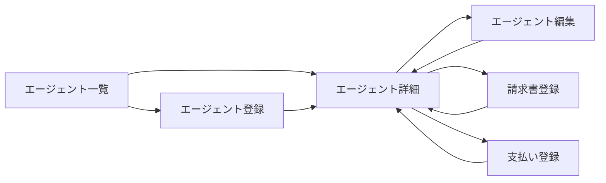

# エージェント管理 UIUX定義

## 操作フロー

### 画面一覧

| 画面名 | パス | 役割 |
|--------|------|------|
| エージェント一覧 | /agents | 全エージェントの一覧・債務残高表示 |
| エージェント詳細 | /agents/:id | エージェント情報・学生一覧・請求書/支払い履歴 |
| エージェント登録 | /agents/new | 新規エージェントの登録 |
| エージェント編集 | /agents/:id/edit | エージェント情報の編集 |
| 請求書登録 | /agents/:id/invoices/new | エージェント請求書の登録 |
| 支払い登録 | /agents/:id/payments/new | エージェントへの支払い登録 |

### 画面遷移

## 画面定義

### エージェント一覧

#### 表示内容

- 参照エンティティ: Agent, AgentInvoice
  - 表示プロパティ: name, country, type, feePerStudent, studentCount, outstandingBalance
- フィルタ:
  - 国
  - 種別（AgentType）
  - 有効/無効
- ソート: エージェント名（デフォルト昇順）
- ページネーション: あり（30件/ページ）

#### 算出プロパティ

| プロパティ | 算出方法 |
|-----------|---------|
| studentCount | このエージェント経由の学生数 |
| outstandingBalance | 未払い請求書の合計金額 |

---

### エージェント詳細

#### 表示内容

- タブ構成:

| タブ | 表示内容 |
|------|---------|
| 基本情報 | エージェント名、国、種別、紹介手数料、連絡先、別名一覧 |
| 学生一覧 | このエージェント経由の全学生（費用支払済フラグ付き） |
| 請求書 | 請求書一覧（番号、日付、金額、ステータス） |
| 支払い | 支払い一覧（番号、日付、金額） |

#### 学生一覧タブの特記事項

- 学生ごとにエージェント費用の支払済フラグを表示
- 未払い学生のハイライト表示
- 「未払いのみ表示」フィルタ

---

### エージェント登録

#### フォーム内容

| フィールド | 型 | 必須 | バリデーション | 備考 |
|-----------|-----|------|---------------|------|
| エージェント名 | text | o | 一意制約 | 正規化後の名称 |
| 国 | select | o | | |
| 種別 | select | o | AgentType Enum | |
| 紹介手数料 | number | - | 正の数 | 1名あたり（円） |
| 連絡先 | text | - | | |
| 備考 | textarea | - | | |
| 別名 | text[] | - | | 複数登録可能。法人名・通称 |

- 送信後の遷移: エージェント詳細

---

### エージェント編集

#### フォーム内容

| フィールド | 型 | 必須 | バリデーション | 備考 |
|-----------|-----|------|---------------|------|
| エージェント名 | text | o | 一意制約 | 正規化後の名称 |
| 国 | select | o | | |
| 種別 | select | o | AgentType Enum | |
| 紹介手数料 | number | - | 正の数 | 1名あたり（円） |
| 連絡先 | text | - | | |
| 備考 | textarea | - | | |
| 有効フラグ | toggle | o | | デフォルト: 有効 |
| 別名 | text[] | - | | 複数登録可能。法人名・通称 |

- 既存データをフォームに初期表示
- 送信後の遷移: エージェント詳細

---

### 請求書登録

#### フォーム内容

| フィールド | 型 | 必須 | バリデーション | 備考 |
|-----------|-----|------|---------------|------|
| 請求日 | date | o | | |
| 金額 | number | o | 正の数 | 円 |
| 備考 | text | - | | |

- 請求書番号は `INV-XXX` 形式で自動採番
- 送信後の遷移: エージェント詳細（請求書タブ）

---

### 支払い登録

#### フォーム内容

| フィールド | 型 | 必須 | バリデーション | 備考 |
|-----------|-----|------|---------------|------|
| 対象請求書 | select | o | 未払い/一部支払いの請求書から選択 | |
| 支払日 | date | o | | |
| 金額 | number | o | 正の数 | |
| 備考 | text | - | | |

- 支払番号は `PAY-XXX` 形式で自動採番
- 送信時の処理:
  1. 支払いレコードを作成
  2. 対象請求書の支払い済み金額を再計算
  3. 全額支払い完了なら請求書ステータスを PAID に更新
  4. 一部支払いなら PARTIAL に更新
- 送信後の遷移: エージェント詳細（支払いタブ）

## アルゴリズム

### エージェント名照合

- 利用箇所: 請求書の法人名からエージェントを特定する際
- 処理内容:
  1. 請求書の法人名で Agent.name を完全一致検索
  2. 一致しない場合、AgentAlias.aliasName を完全一致検索
  3. どちらにも一致しない場合、手動での紐付けを求める
- 副作用: なし

### 債務残高計算

- 利用箇所: エージェント一覧の outstandingBalance 表示
- 処理内容:
  1. 対象エージェントの全 AgentInvoice の amount を合計
  2. 対象エージェントの全 AgentPayment の amount を合計
  3. `債務残高 = 請求合計 − 支払い合計`
- 副作用: なし
