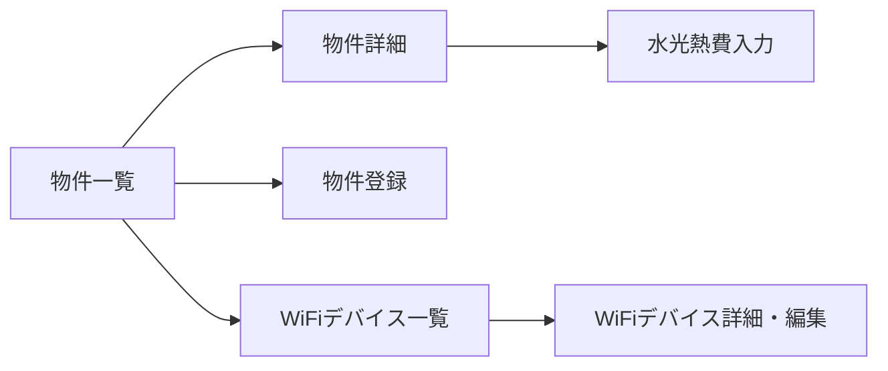

# 施設・備品管理 UIUX定義

## 操作フロー

### 画面一覧

| 画面名 | パス | 役割 |
|--------|------|------|
| 物件一覧 | /facilities/dormitories | 全寮物件の一覧・入居者数表示 |
| 物件詳細 | /facilities/dormitories/:id | 物件情報・入居者一覧・水光熱費履歴 |
| 物件登録 | /facilities/dormitories/new | 新規物件の登録 |
| 水光熱費入力 | /facilities/utilities/input | 月次水光熱費の一括入力 |
| WiFiデバイス一覧 | /facilities/wifi | 全WiFiデバイスの管理 |
| WiFiデバイス詳細・編集 | /facilities/wifi/:id | WiFiデバイスの詳細表示・編集 |

### 画面遷移

## 画面定義

### 物件一覧

#### 表示内容

- 参照エンティティ: Dormitory, DormitoryAssignment
  - 表示プロパティ: name, address, rent, currentResidentCount
- フィルタ: 有効/無効
- ソート: 物件名（デフォルト昇順）

#### 算出プロパティ

| プロパティ | 算出方法 |
|-----------|---------|
| currentResidentCount | moveOutDate が null の DormitoryAssignment 数 |

---

### 物件詳細

#### 表示内容

- タブ構成:

| タブ | 表示内容 |
|------|---------|
| 基本情報 | 物件名、住所、家賃、ライフライン契約情報 |
| 入居者一覧 | 現在入居中の学生リスト（moveOutDate が null） |
| 入退寮履歴 | 全 DormitoryAssignment の時系列表示 |
| 水光熱費 | 月次の電気・ガス・水道代の推移 |

---

### 水光熱費入力

#### フォーム内容

| フィールド | 型 | 必須 | バリデーション | 備考 |
|-----------|-----|------|---------------|------|
| 対象年月 | month-picker | o | | |

- 対象年月を選択すると、全有効物件の電気・ガス・水道の入力グリッドが表示される
- 物件ごとに3列（電気・ガス・水道）を入力
- 送信後の遷移: 物件一覧

---

### 物件登録

#### フォーム内容

| フィールド | 型 | 必須 | バリデーション | 備考 |
|-----------|-----|------|---------------|------|
| 物件名 | text | o | 重複不可 | |
| 住所 | text | o | | |
| 家賃 | number | o | 0以上 | 月額（円） |
| ガス契約先 | text | - | | |
| ガス契約番号 | text | - | | |
| 水道契約先 | text | - | | |
| 水道契約番号 | text | - | | |
| 電気契約先 | text | - | | |
| 電気契約番号 | text | - | | |
| 有効フラグ | toggle | - | | デフォルト: ON |
| 備考 | textarea | - | | |

- 送信後の遷移: 物件一覧

---

### WiFiデバイス一覧

#### 表示内容

- 参照エンティティ: WifiDevice
  - 表示プロパティ: name, imei, location, contractNumber, isActive
- フィルタ: 有効/無効
- ソート: デバイス名（デフォルト昇順）

---

### WiFiデバイス詳細・編集

#### フォーム内容

| フィールド | 型 | 必須 | バリデーション | 備考 |
|-----------|-----|------|---------------|------|
| デバイス名 | text | o | | |
| IMEI | text | o | 重複不可 | デバイスの一意識別子 |
| 配置場所 | text | o | | |
| 契約番号 | text | - | | |
| 有効フラグ | toggle | - | | デフォルト: ON |
| 備考 | textarea | - | | |

- 送信後の遷移: WiFiデバイス一覧
