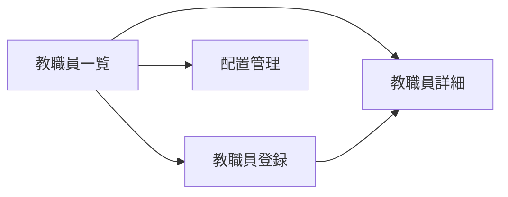

# 教職員管理 UIUX定義

## 操作フロー

### 画面一覧

| 画面名 | パス | 役割 |
|--------|------|------|
| 教職員一覧 | /staff | 全教職員の一覧表示・検索・フィルタ |
| 教職員詳細 | /staff/:id | 教職員の全情報表示・編集 |
| 教職員登録 | /staff/new | 新規教職員の登録 |
| 配置管理 | /staff/assignment | 教員のクラス配置状況一覧 |

### 画面遷移

## 画面定義

### 教職員一覧

#### 表示内容

- 参照エンティティ: Staff, TeacherQualification
  - 表示プロパティ: name, role, employmentType, isActive, maxWeeklyLessons
- フィルタ:
  - 役職（StaffRole）
  - 雇用形態（EmploymentType）
  - 在職/退職（isActive）
- ソート: 氏名（デフォルト昇順）
- ページネーション: あり（50件/ページ）
- 検索: 氏名で部分一致検索

#### アクション

| アクション | 遷移先 | 条件 |
|-----------|--------|------|
| 行クリック | 教職員詳細 | - |
| 新規登録ボタン | 教職員登録 | - |
| 配置管理ボタン | 配置管理 | - |

---

### 教職員詳細

#### 表示内容

- 参照エンティティ: Staff, TeacherQualification
- タブ構成:

| タブ | 表示内容 |
|------|---------|
| 基本情報 | 氏名、メール、電話番号、役職、雇用形態、入社日、退職日、給与形態 |
| 資格一覧 | 保有資格の一覧（資格種別、取得日、有効期限） |
| 担当クラス・時間割 | 担当クラス一覧、週間コマ数、時間割表示 |

#### 編集

- 各タブ内で直接編集可能（インライン編集）
- 資格の追加・削除は資格一覧タブから実行

---

### 教職員登録

#### フォーム内容

| フィールド | 型 | 必須 | バリデーション | 備考 |
|-----------|-----|------|---------------|------|
| 氏名 | text | o | 1文字以上 | |
| メールアドレス | email | - | メール形式 | |
| 電話番号 | tel | - | | |
| 役職 | select | o | StaffRole Enum | |
| 雇用形態 | select | o | EmploymentType Enum | |
| 入社日 | date | o | | |
| 給与形態 | select | - | PayType Enum | 非常勤の場合に入力 |
| 週間コマ数上限 | number | - | 0〜25 | 教員の場合に入力 |

- 送信後の遷移: 教職員詳細画面
- 資格情報は詳細画面から追加する（登録時には入力しない）

---

### 配置管理

#### 表示内容

- 参照エンティティ: Staff, Class（時間割経由）
- 表示形式: マトリクス表（教員 x クラス）
  - 行: 教員（常勤→非常勤の順）
  - 列: クラス
  - セル: 担当コマ数
- サマリ表示:
  - 教員ごとの週間合計コマ数
  - クラスごとの担当教員数
  - 配置基準の充足状況（警告表示）

#### 配置基準チェック

配置状況が以下の基準を満たさない場合、警告を表示する。

| 基準 | ルール | 根拠 |
|------|--------|------|
| 教員数 | 学生20名につき教員1名以上 | 告示基準第10号 |
| 専任教員数 | 学生40名につき専任（常勤）教員1名以上 | 告示基準第11号 |
| 常勤比率 | 教員の過半数は常勤 | 告示基準第11号 |

## アルゴリズム

### 教員配置基準チェック

- 利用箇所: 配置管理画面、ダッシュボード
- 処理内容:
  1. 在学生（status = ENROLLED）の総数を取得
  2. 有効な教員（isActive = true かつ role が教員系）の総数を取得
  3. 有効な常勤教員（employmentType = FULL_TIME）の数を取得
  4. 以下を判定:
     - 学生数 / 20 <= 教員総数 であること
     - 学生数 / 40 <= 常勤教員数 であること
     - 常勤教員数 > 教員総数 / 2 であること
  5. 基準未達の場合、該当項目に警告を表示
- 副作用: なし（読み取り専用）

### 週間コマ数超過チェック

- 利用箇所: 時間割登録時、配置管理画面
- 処理内容:
  1. 対象教員の現在の週間担当コマ数を集計
  2. maxWeeklyLessons を超過する場合、警告を表示（登録自体はブロックしない）
- 副作用: なし
