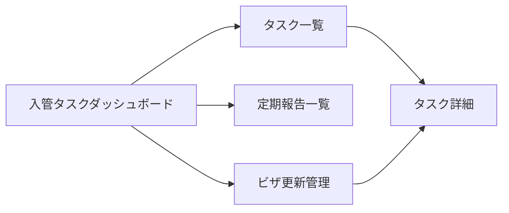

# 入管報告・届出 UIUX定義

## 操作フロー

### 画面一覧

| 画面名 | パス | 役割 |
|--------|------|------|
| 入管タスクダッシュボード | /immigration | 期限間近のタスク・年間スケジュール |
| タスク一覧 | /immigration/tasks | 全入管タスクの一覧・フィルタ |
| タスク詳細 | /immigration/tasks/:id | タスクの詳細・書類収集状態 |
| 定期報告一覧 | /immigration/reports | 年間定期報告のスケジュール管理 |
| ビザ更新管理 | /immigration/visa-renewals | ビザ更新が必要な学生一覧 |

### 画面遷移

## 画面定義

### 入管タスクダッシュボード

#### 表示内容

- **期限間近アラート**: 期限7日以内の未完了タスク（赤: 期限超過、黄: 7日以内）
- **今月のタスク**: 今月期限の全タスク
- **年間カレンダー**: 定期報告のスケジュールをガントチャート風に表示
- **ビザ更新予定**: 在留期限3ヶ月以内の学生数

---

### タスク一覧

#### 表示内容

- 参照エンティティ: ImmigrationTask
  - 表示プロパティ: taskType, studentName, deadline, status, legalBasis
- フィルタ:
  - ステータス（TaskStatus）
  - タスク種別（ImmigrationTaskType）
  - トリガー（イベント/スケジュール）
- ソート: 期限昇順（デフォルト）
- ページネーション: あり（30件/ページ）

---

### タスク詳細

#### 表示内容

- タスク情報: 種別、対象学生、期限、根拠法令、届出方法
- **書類チェックリスト**: ImmigrationDocument の一覧
  - 各書類の収集状態をチェックボックスで表示
  - 全書類が「回収済み」または「自動生成」になったら提出可能状態を表示

#### アクション

| アクション | 処理 |
|-----------|------|
| 書類状態の更新 | CollectionStatus を変更 |
| タスク完了 | status を DONE に更新、completedAt を記録 |

---

### 定期報告一覧

#### 表示内容

- 参照エンティティ: ScheduledReport
  - 表示プロパティ: reportType, fiscalYear, deadline, status
- 年度フィルタ
- 6月集中期間のハイライト表示

---

### ビザ更新管理

#### 表示内容

- 参照エンティティ: Student（residenceExpiry でフィルタ）
  - 表示プロパティ: studentNumber, nameEn, nationality, residenceExpiry, daysUntilExpiry
- フィルタ:
  - 残り期間（3ヶ月以内 / 2ヶ月以内 / 1ヶ月以内）
- ソート: 在留期限昇順（デフォルト）

#### アクション

| アクション | 処理 |
|-----------|------|
| ビザ更新タスク作成 | 対象学生の VISA_RENEWAL タスクを作成し、必要書類リストを自動追加 |

## アルゴリズム

### イベントベースタスクの自動生成

- 利用箇所: 学生ステータス変更時
- 処理内容:
  - 退学/除籍 → WITHDRAWAL_REPORT + DEPARTURE_NOTIFICATION を自動生成
  - 入学（在学に変更） → ENROLLMENT_NOTIFICATION を自動生成
  - 月次出席率50%未満検出 → LOW_ATTENDANCE_REPORT を自動生成
- 期限: 各報告の法定期限に基づき自動設定
- 副作用: ImmigrationTask の作成

### 定期報告スケジュールの自動生成

- 利用箇所: 年度開始時（自動）
- 処理内容:
  1. 新年度の ScheduledReport を ScheduledReportType の全種別分作成
  2. 各報告の deadline を設定
- 副作用: ScheduledReport の作成

### ビザ更新アラート

- 利用箇所: 日次バッチ
- 処理内容:
  1. 全在学生の residenceExpiry をスキャン
  2. 期限3ヶ月前の学生を抽出
  3. まだ VISA_RENEWAL タスクが未作成なら自動生成
- 副作用: ImmigrationTask の作成
