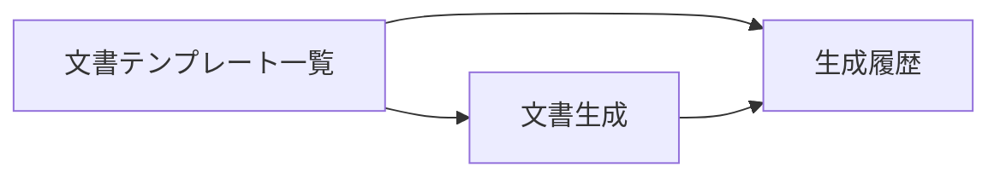

# 社内文書 UIUX定義

## 操作フロー

### 画面一覧

| 画面名 | パス | 役割 |
|--------|------|------|
| 文書テンプレート一覧 | /documents | 利用可能な文書テンプレート一覧 |
| 文書生成 | /documents/:templateId/generate | フォーム入力→文書生成 |
| 生成履歴 | /documents/history | 過去に生成した文書の履歴 |

### 画面遷移

## 画面定義

### 文書テンプレート一覧

#### 表示内容

- 参照エンティティ: DocumentTemplate
  - 表示プロパティ: name, outputFormat, description
- カード形式で表示
- クリックで文書生成画面へ

---

### 文書生成

#### フォーム内容

テンプレートごとに異なる動的フォームを表示する。フォーム定義はフロントエンドのコードベースで管理する（テンプレート数が少なく固定的なため、DB管理は不要）。

##### テンプレート別フォーム定義

| テンプレート (slug) | 入力フィールド | 型 | 必須 |
|-------------------|-------------|-----|------|
| shukkin-irai（出金依頼書） | 支払先名、金額、摘要、支払日、依頼者 | text, number, text, date, select(Staff) | 全て必須 |
| inkan-shinsei（押印申請書） | 文書名、押印種別、用途、申請者 | text, select, text, select(Staff) | 全て必須 |
| ringi-sakusei（稟議書） | 件名、金額、内容（長文）、起案者 | text, number, textarea, select(Staff) | 全て必須 |
| shakai-hoken-soushitsu（社会保険喪失届） | 対象者、喪失日、喪失理由 | select(Staff), date, select | 全て必須 |

- 送信時の処理: テンプレートに基づき文書を生成し、ダウンロードまたは保存
- 送信後の遷移: 生成履歴

---

### 生成履歴

#### 表示内容

- 参照エンティティ: GeneratedDocument
  - 表示プロパティ: templateName, fileName, createdByName, createdAt, notes
- ソート: 作成日時降順
- ページネーション: あり（20件/ページ）

#### アクション

| アクション | 処理 |
|-----------|------|
| ダウンロード | 生成済みファイルをダウンロード |
