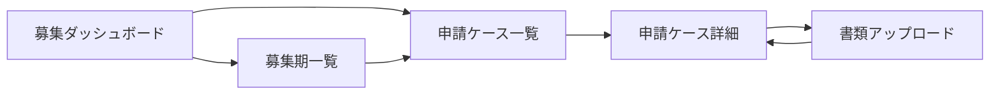

# 募集業務 UIUX定義

## 操作フロー

### 画面一覧

| 画面名 | パス | 役割 |
|--------|------|------|
| 募集ダッシュボード | /recruitment | 現在の募集期の概況・サマリー |
| 募集期一覧 | /recruitment/cycles | 過去の募集期一覧 |
| 申請ケース一覧 | /recruitment/cycles/:cycleId/cases | 募集期内の申請ケース一覧 |
| 申請ケース詳細 | /recruitment/cases/:id | ケース情報 + 書類チェックリスト |
| 書類アップロード | /recruitment/cases/:id/upload | エージェント向けアップロードフォーム |

### 画面遷移

## 画面定義

### 募集ダッシュボード

#### 表示内容

- 参照エンティティ: RecruitmentCycle, ApplicationCase
  - 表示プロパティ: enrollmentMonth, fiscalYear, targetCount, applicationCount, grantedCount, grantRate
- 現在進行中の募集期を自動表示（直近の applicationDeadline が未来の募集期）

#### サマリーカード

| カード | 表示内容 |
|--------|---------|
| 申請数 | 現在の募集期の申請ケース数 |
| 交付数 | ステータスが GRANTED のケース数 |
| 交付率 | 交付数 / 申請数（%） |
| 書類充足率 | 全ケースの書類収集進捗の平均 |

#### ステータス別グラフ

- ApplicationStatus ごとの件数を棒グラフで表示
- 国籍別の内訳を表示

---

### 募集期一覧

#### 表示内容

- 参照エンティティ: RecruitmentCycle
  - 表示プロパティ: enrollmentMonth, fiscalYear, applicationDeadline, targetCount, applicationCount, grantedCount, grantRate
- ソート: fiscalYear × enrollmentMonth の降順（最新の募集期が上）
- ページネーション: あり（30件/ページ）

---

### 申請ケース一覧

#### 表示内容

- 参照エンティティ: ApplicationCase, Agent
  - 表示プロパティ: candidateName, nationality, agentName, applicationNumber, status, documentCompletionRate
- フィルタ:
  - ステータス（ApplicationStatus）
  - 国籍
  - エージェント
  - 別表掲載国フラグ
- ソート: candidateName（デフォルト昇順）
- ページネーション: あり（30件/ページ）

#### 算出プロパティ

| プロパティ | 算出方法 |
|-----------|---------|
| agentName | agentId から Agent.name を参照 |
| documentCompletionRate | 書類充足率算出アルゴリズムで算出 |

---

### 申請ケース詳細

#### 表示内容

- タブ構成:

| タブ | 表示内容 |
|------|---------|
| 基本情報 | 候補者氏名、国籍、エージェント名、申請番号、ステータス、別表掲載国フラグ、備考 |
| 書類チェックリスト | 必要書類一覧 + 各書類の収集状態・チェック結果 |

#### 書類チェックリストタブの特記事項

- 必要書類リスト自動生成アルゴリズムにより、このケースに必要な書類を一覧表示
- 各書類について以下を表示:
  - 書類種別
  - 収集状態（カラーバッジ: 未受領=グレー、受領済=青、確認済=緑、不備あり=赤）
  - 日本語訳有無
  - チェック結果（OK/NG）
  - 備考
- 未受領・不備ありの書類をハイライト表示
- 「未完了のみ表示」フィルタ

#### ステータス変更

- ステータス変更ボタン: 現在のステータスに応じて遷移可能なステータスのみ表示
- GRANTED への変更時: grantedDate の入力を求める
- DENIED への変更時: denialReason の入力を求める

---

### 書類アップロード

#### フォーム内容

| フィールド | 型 | 必須 | バリデーション | 備考 |
|-----------|-----|------|---------------|------|
| 書類種別 | select | o | DocumentType Enum | |
| ファイル | file | o | PDF/画像ファイル | |
| 日本語訳あり | checkbox | - | | デフォルト: false |
| 備考 | text | - | | |

- 送信後の遷移: 申請ケース詳細（書類チェックリストタブ）
- アップロード時の処理:
  1. ファイルを保存し filePath を設定
  2. collectionStatus を RECEIVED に更新
  3. hasJapaneseTranslation を設定

::: info エージェント向けフォーム
将来的にはエージェントが直接アクセスできるアップロードフォームを提供する想定。エージェントごとに認証付きのURLを発行し、自分の担当ケースの書類のみアップロード可能にする。
:::

## アルゴリズム

### 必要書類リスト自動生成

- 利用箇所: 申請ケース詳細の書類チェックリスト表示時
- 処理内容:
  1. 対象 ApplicationCase の isListedCountry を取得
  2. 基本書類（APPLICATION_FORM, CHECKLIST, PASSPORT_COPY）は全ケース必須
  3. isListedCountry = false の場合、追加書類（JAPANESE_ABILITY, FINANCIAL_SUPPORT, RELATIONSHIP_PROOF, BANK_BALANCE, FUND_FORMATION）を必須に追加
  4. 必要書類リストに対応する ApplicationDocument が未作成の場合、collectionStatus = NOT_RECEIVED で自動作成
- 副作用: ApplicationDocument レコードの自動作成

### 書類充足率算出

- 利用箇所: 申請ケース一覧の documentCompletionRate、募集ダッシュボードの書類充足率
- 処理内容:
  1. 対象 ApplicationCase の必要書類リストを取得（必要書類リスト自動生成アルゴリズムと同じロジック）
  2. 必要書類のうち collectionStatus が VERIFIED のものを数える
  3. `書類充足率 = VERIFIED の書類数 / 必要書類数`
- 副作用: なし

### 募集期サマリー

- 利用箇所: 募集ダッシュボード、募集期一覧
- 処理内容:
  1. 対象 RecruitmentCycle に紐づく全 ApplicationCase を取得
  2. 申請数 = status が WITHDRAWN 以外の ApplicationCase 数
  3. 交付数 = status が GRANTED の ApplicationCase 数
  4. 交付率 = 交付数 / 申請数（申請数が0の場合は0%）
- 副作用: なし
