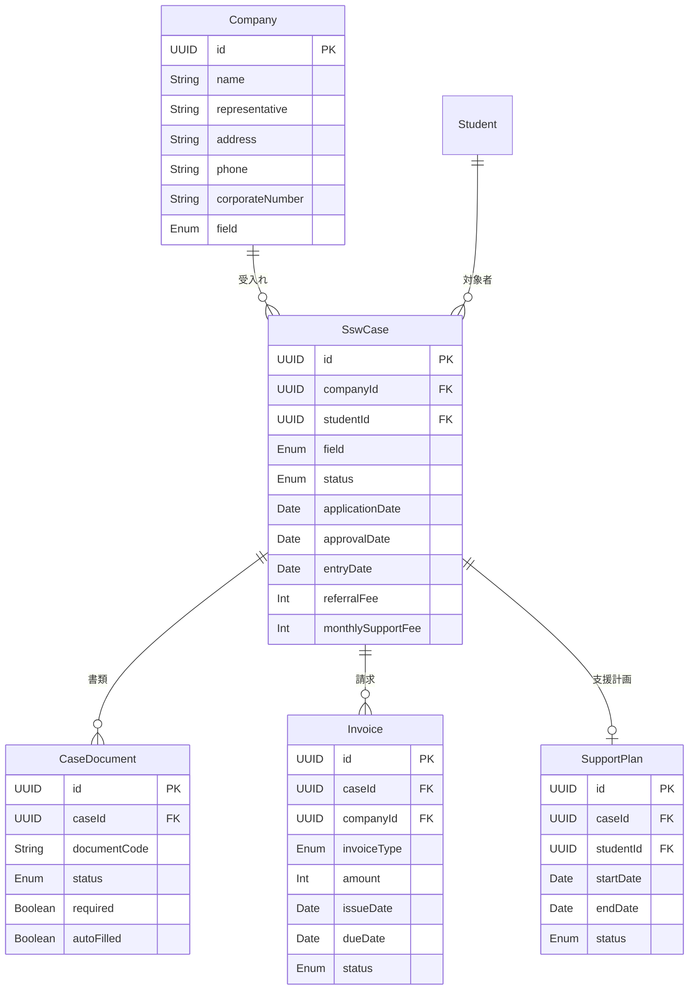

# 特定技能・職業紹介 エンティティ定義

## ER図

---

## Company / 受入れ企業

特定技能外国人を雇用する企業。案件の受け皿。

| プロパティ | 英語名 | 型 | デフォルト | nullable | unique | 制約・バリデーション |
|-----------|--------|-----|-----------|----------|--------|---------------------|
| ID | id | UUID | auto | - | o | PK |
| 企業名 | name | String | - | - | - | |
| 代表者名 | representative | String | - | - | - | |
| 郵便番号 | postalCode | String | - | o | - | |
| 所在地 | address | String | - | - | - | |
| 電話番号 | phone | String | - | - | - | |
| 分野 | field | Enum(SswField) | - | - | - | 当社実績のある5分野 |
| 営業許可 | businessLicense | String | - | o | - | 旅館業許可等。分野により必要 |
| 法人番号 | corporateNumber | String | - | o | o | 13桁 |
| 設立年月日 | establishedDate | Date | - | o | - | |
| 備考 | notes | String | - | o | - | |
| 作成日時 | createdAt | DateTime | auto | - | - | |
| 更新日時 | updatedAt | DateTime | auto | - | - | |

### リレーション

- Company → SswCase: この企業の案件 (1:N)
- Company → Invoice: この企業への請求 (1:N)

---

## SswCase / 案件

特定技能の申請案件。学生と企業を紐づけ、営業から支援終了までのライフサイクルを管理する。

| プロパティ | 英語名 | 型 | デフォルト | nullable | unique | 制約・バリデーション |
|-----------|--------|-----|-----------|----------|--------|---------------------|
| ID | id | UUID | auto | - | o | PK |
| 企業ID | companyId | UUID | - | - | - | FK → Company |
| 学生ID | studentId | UUID | - | - | - | FK → Student |
| 分野 | field | Enum(SswField) | - | - | - | |
| ステータス | status | Enum(CaseStatus) | PROSPECTING | - | - | 8段階 |
| 申請日 | applicationDate | Date | - | o | - | ステータスが APPLIED 以降で設定 |
| 許可日 | approvalDate | Date | - | o | - | ステータスが APPROVED 以降で設定 |
| 入社日 | entryDate | Date | - | o | - | ステータスが EMPLOYED 以降で設定 |
| 紹介料 | referralFee | Int | 150000 | - | - | 円。正の数 |
| 月額支援費 | monthlySupportFee | Int | 10000 | - | - | 円。正の数 |
| 備考 | notes | String | - | o | - | |
| 作成日時 | createdAt | DateTime | auto | - | - | |
| 更新日時 | updatedAt | DateTime | auto | - | - | |

### リレーション

- SswCase → Company: 受入れ企業 (N:1)
- SswCase → Student: 対象学生 (N:1) ※ Student は 02-student-management で定義
- SswCase → CaseDocument: この案件の書類 (1:N)
- SswCase → SupportPlan: この案件の支援計画 (1:0..1)
- SswCase → Invoice: この案件の請求 (1:N)

### ビジネスルール

- 同一学生 × 同一企業の組み合わせは一意（重複案件不可）
- ステータス遷移: PROSPECTING → PREPARING → APPLIED → REVIEWING → APPROVED → EMPLOYED → SUPPORTING → CLOSED
- 「不成立」の場合はどのステータスからも CLOSED に遷移可能
- 紹介料のデフォルトは150,000円だが案件ごとに変更可能（例：ゴック案件は300,000円）

---

## CaseDocument / 案件書類

案件ごとの書類ステータス管理。申請書類（DOC系）と証憑書類（COL系）の両方を管理する。

| プロパティ | 英語名 | 型 | デフォルト | nullable | unique | 制約・バリデーション |
|-----------|--------|-----|-----------|----------|--------|---------------------|
| ID | id | UUID | auto | - | o | PK |
| 案件ID | caseId | UUID | - | - | - | FK → SswCase |
| 書類コード | documentCode | String | - | - | - | DOC-001〜DOC-013, COL-001〜COL-023 |
| 書類名 | documentName | String | - | - | - | |
| ステータス | status | Enum(DocumentStatus) | NOT_STARTED | - | - | |
| 必須 | required | Boolean | true | - | - | 条件分岐ルールで判定 |
| 自動入力済み | autoFilled | Boolean | false | - | - | DOC系で自動入力した場合 |
| スキップ理由 | skipReason | String | - | o | - | 免除の場合の理由 |
| 備考 | notes | String | - | o | - | |
| 作成日時 | createdAt | DateTime | auto | - | - | |
| 更新日時 | updatedAt | DateTime | auto | - | - | |

### リレーション

- CaseDocument → SswCase: 所属案件 (N:1)

### ビジネスルール

- 案件作成時に、分野・国籍・保険種別に応じた条件分岐ルールに基づいて必要書類を自動生成
- 同一案件内で同一 documentCode は一意
- 全ての必須書類が「完了」になるまで案件ステータスを「申請中」に進められない

### 条件分岐ルール（書類の必要/不要判定）

| 条件 | 対象書類 | 判定 |
|---|---|---|
| 技能実習2号修了者 | COL-003（技能試験）, COL-004（日本語試験） | 不要（免除） |
| 介護分野 | COL-020（介護日本語評価試験合格証） | 必須 |
| 宿泊分野 | COL-021（旅館業許可証の写し） | 必須 |
| 自動車運送業分野 | COL-022（運転免許証）, COL-023（協議会構成員資格証明書） | 必須 |
| カンボジア/タイ/ベトナム国籍 | COL-019（二国間取決に係る書類） | 必須 |
| 国民健康保険加入者 | COL-008, COL-009 | 必須 |
| 国民年金加入者 | COL-010, COL-011 | 必須 |
| 全部委託（常に true） | DOC-009（委託契約説明書） | 必須 |

---

## SupportPlan / 支援計画

特定技能外国人への義務的支援計画。案件と紐づけて管理する。

| プロパティ | 英語名 | 型 | デフォルト | nullable | unique | 制約・バリデーション |
|-----------|--------|-----|-----------|----------|--------|---------------------|
| ID | id | UUID | auto | - | o | PK |
| 案件ID | caseId | UUID | - | - | o | FK → SswCase |
| 学生ID | studentId | UUID | - | - | - | FK → Student |
| 支援開始日 | startDate | Date | - | - | - | |
| 支援終了日 | endDate | Date | - | o | - | 継続中の場合は null |
| ステータス | status | Enum(SupportPlanStatus) | ACTIVE | - | - | |
| 備考 | notes | String | - | o | - | |
| 作成日時 | createdAt | DateTime | auto | - | - | |
| 更新日時 | updatedAt | DateTime | auto | - | - | |

### リレーション

- SupportPlan → SswCase: 対象案件 (N:1)
- SupportPlan → Student: 支援対象の学生 (N:1) ※ Student は 02-student-management で定義

### ビジネスルール

- 同一学生に対して ACTIVE な支援計画は1つのみ
- 案件ステータスが SUPPORTING になったときに作成
- 終了時に endDate を設定し、ステータスを COMPLETED に変更
- 月額支援費は案件（SswCase）側で管理

---

## Invoice / 請求

受入れ企業への請求管理。紹介料（一括）と月額支援費（毎月）の2種類。

| プロパティ | 英語名 | 型 | デフォルト | nullable | unique | 制約・バリデーション |
|-----------|--------|-----|-----------|----------|--------|---------------------|
| ID | id | UUID | auto | - | o | PK |
| 案件ID | caseId | UUID | - | - | - | FK → SswCase |
| 企業ID | companyId | UUID | - | - | - | FK → Company |
| 請求番号 | invoiceNumber | String | - | - | o | YYYYMMDD-連番 |
| 請求種別 | invoiceType | Enum(InvoiceType) | - | - | - | REFERRAL / SUPPORT |
| 金額（税抜） | amount | Int | - | - | - | 円。正の数 |
| 消費税 | tax | Int | - | - | - | 円。amount の 10% |
| 発行日 | issueDate | Date | - | - | - | |
| 支払期日 | dueDate | Date | - | - | - | 翌月末 |
| ステータス | status | Enum(InvoiceStatus) | DRAFT | - | - | |
| 備考 | notes | String | - | o | - | |
| 作成日時 | createdAt | DateTime | auto | - | - | |
| 更新日時 | updatedAt | DateTime | auto | - | - | |

### リレーション

- Invoice → SswCase: 対象案件 (N:1)
- Invoice → Company: 請求先企業 (N:1)

### ビジネスルール

- 紹介料請求（REFERRAL）: 案件ステータスが EMPLOYED になったときに自動生成
- 支援費請求（SUPPORT）: 支援計画が ACTIVE の間、毎月自動生成
- 消費税は外税（10%）
- 振込先: 足利銀行 つくば支店 普通 5033625

---

## Enum 定義

### SswField / 特定技能分野

当社の紹介実績がある5分野のみ。

| 値 | 表示名 |
|----|--------|
| NURSING_CARE | 介護 |
| ACCOMMODATION | 宿泊 |
| FOOD_SERVICE | 外食業 |
| FOOD_MANUFACTURING | 飲食料品製造業 |
| AUTO_TRANSPORT | 自動車運送業 |

::: info 分野の拡張
制度上は16分野あるが、当社の実績がある5分野のみを Enum として定義。新たな分野に進出する際に Enum を追加する。
:::

### CaseStatus / 案件ステータス

| 値 | 表示名 | 備考 |
|----|--------|------|
| PROSPECTING | 営業中 | 企業と候補者のマッチング段階 |
| PREPARING | 書類準備中 | 内定後、申請書類を準備中 |
| APPLIED | 申請中 | 入管に申請書類を提出済み |
| REVIEWING | 審査中 | 入管が審査中 |
| APPROVED | 許可済み | 在留資格変更が許可された |
| EMPLOYED | 入社済み | 受入れ企業に入社した |
| SUPPORTING | 支援中 | 義務的支援を実施中 |
| CLOSED | 終了 | 退職/帰国/期間満了/不成立 |

### DocumentStatus / 書類ステータス

| 値 | 表示名 | 備考 |
|----|--------|------|
| NOT_STARTED | 未着手 | まだ手をつけていない |
| DRAFTING | 作成中 | 当社が作成中（DOC系） |
| REQUESTED | 収集依頼中 | 申請人または企業に依頼済み（COL系） |
| COLLECTED | 収集済み | 受領済み |
| AUTO_FILLED | 自動入力済み | 学生DBからの自動入力が完了 |
| PENDING_REVIEW | 確認待ち | 内容確認待ち |
| COMPLETED | 完了 | 最終確認済み、申請可能な状態 |
| NOT_REQUIRED | 不要 | この案件では不要（免除・条件外） |
| RETURNED | 差戻し | 不備があり再提出が必要 |

### SupportPlanStatus / 支援計画ステータス

| 値 | 表示名 |
|----|--------|
| ACTIVE | 実施中 |
| COMPLETED | 完了 |
| CANCELLED | 取消 |

### InvoiceType / 請求種別

| 値 | 表示名 | 備考 |
|----|--------|------|
| REFERRAL | 紹介料 | 入社時に一括請求。デフォルト 150,000円 |
| SUPPORT | 登録支援費 | 毎月請求。デフォルト 10,000円 |

### InvoiceStatus / 請求ステータス

| 値 | 表示名 | 備考 |
|----|--------|------|
| DRAFT | 下書き | 自動生成直後 |
| ISSUED | 発行済み | 企業に送付済み |
| PAID | 入金済み | 入金確認済み |
| OVERDUE | 未入金 | 支払期日超過 |
