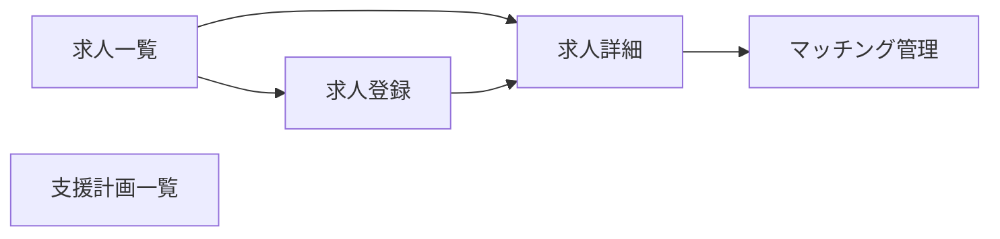

# 特定技能・職業紹介 UIUX定義

## 操作フロー

### 画面一覧

| 画面名 | パス | 役割 |
|--------|------|------|
| 求人一覧 | /jobs | 求人情報の一覧・管理 |
| 求人詳細 | /jobs/:id | 求人情報 + マッチング一覧 |
| 求人登録 | /jobs/new | 求人の新規登録 |
| マッチング管理 | /matching | 学生×求人のマッチング状況一覧 |
| 支援計画一覧 | /support-plans | 支援計画の管理 |

### 画面遷移

## 画面定義

### 求人一覧

#### 表示内容

- 参照エンティティ: JobPosting, JobMatch
  - 表示プロパティ: companyName, jobCategory, workLocation, monthlySalary, status, matchCount
- フィルタ:
  - 分野（SpecifiedSkilledWorkerField）
  - ステータス（JobPostingStatus）
  - 勤務地（テキスト検索）
- ソート: 作成日時（デフォルト降順）
- ページネーション: あり（30件/ページ）

#### 算出プロパティ

| プロパティ | 算出方法 |
|-----------|---------|
| matchCount | この求人に紐づくマッチング数 |

---

### 求人詳細

#### 表示内容

- タブ構成:

| タブ | 表示内容 |
|------|---------|
| 基本情報 | 企業名、分野、職種詳細、勤務地、給与、雇用形態、募集人数、備考 |
| マッチング | この求人に対するマッチング一覧（学生名、ステータス、推薦日、面接日、内定日） |

#### マッチングタブの特記事項

- マッチングステータスごとの色分け表示
- ステータス変更はドロップダウンから直接操作可能
- 「候補追加」ボタンから学生を選択してマッチング作成

---

### 求人登録

#### フォーム内容

| フィールド | 型 | 必須 | バリデーション | 備考 |
|-----------|-----|------|---------------|------|
| 企業名 | text | o | | |
| 職種分野 | select | o | SpecifiedSkilledWorkerField Enum | 特定技能12分野 |
| 職種詳細 | text | o | | |
| 勤務地 | text | o | | |
| 給与（月額） | number | - | 正の数 | 円 |
| 雇用形態 | text | o | | |
| 募集人数 | number | - | 正の整数 | デフォルト1 |
| 備考 | textarea | - | | |

- 送信後の遷移: 求人詳細

---

### マッチング管理

#### 表示内容

- 参照エンティティ: JobMatch, JobPosting, Student
  - 表示プロパティ: studentName, companyName, jobCategory, status, recommendedDate, interviewDate, offerDate
- フィルタ:
  - マッチングステータス（JobMatchStatus）
  - 分野（SpecifiedSkilledWorkerField）
- ソート: 更新日時（デフォルト降順）
- ページネーション: あり（30件/ページ）

#### 操作

- 一覧からステータス変更が可能
- ステータス変更時に対応する日付（推薦日・面接日・内定日）を自動入力

---

### 支援計画一覧

#### 表示内容

- 参照エンティティ: SupportPlan, Student
  - 表示プロパティ: studentName, supportOrganization, startDate, endDate, monthlySupportFee, status
- フィルタ:
  - ステータス（SupportPlanStatus）
- ソート: 支援開始日（デフォルト降順）
- ページネーション: あり（30件/ページ）

#### 操作

- 新規登録ボタンから支援計画を作成
- 一覧からステータス変更が可能

::: info 将来的な拡張
本カテゴリは将来的な拡張領域として設計。学生管理のデータ基盤を活用し、画面はシンプルに保つ方針。
:::
