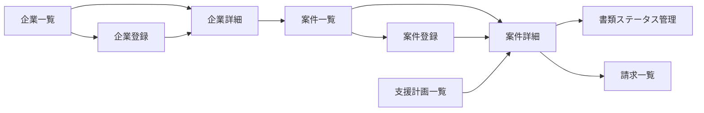

# 特定技能・職業紹介 UIUX定義

## 操作フロー

### 画面一覧

| 画面名 | パス | 役割 |
|--------|------|------|
| 案件一覧 | /ssw/cases | 全案件の一覧・ステータス管理 |
| 案件詳細 | /ssw/cases/:id | 案件情報 + 書類ステータス + 請求 |
| 案件登録 | /ssw/cases/new | 案件の新規登録 |
| 企業一覧 | /ssw/companies | 受入れ企業の一覧・管理 |
| 企業詳細 | /ssw/companies/:id | 企業情報 + 紐づく案件一覧 |
| 企業登録 | /ssw/companies/new | 企業の新規登録 |
| 支援計画一覧 | /ssw/support-plans | 支援計画の管理 |
| 請求一覧 | /ssw/invoices | 請求書の一覧・入金管理 |

### 画面遷移

## 画面定義

### 案件一覧

#### 表示内容

- 参照エンティティ: SswCase, Company, Student
  - 表示プロパティ: studentName, companyName, field, status, applicationDate, approvalDate, entryDate
- フィルタ:
  - ステータス（CaseStatus）
  - 分野（SswField）
  - 企業名（テキスト検索）
- ソート: 更新日時（デフォルト降順）
- ページネーション: あり（30件/ページ）

#### 算出プロパティ

| プロパティ | 算出方法 |
|-----------|---------|
| documentProgress | 必須書類の完了数 / 必須書類の総数（%表示） |

#### 操作

- 一覧からステータスを直接変更可能
- ステータス変更時に対応する日付を自動入力（APPLIED → applicationDate, APPROVED → approvalDate, EMPLOYED → entryDate）

---

### 案件詳細

#### 表示内容

- タブ構成:

| タブ | 表示内容 |
|------|---------|
| 基本情報 | 企業名、学生名、分野、ステータス、各種日付、紹介料、月額支援費、備考 |
| 書類ステータス | 案件に紐づく全書類の進捗一覧（3テーブル構成） |
| 請求 | この案件の請求書一覧（紹介料・月額支援費） |
| 支援計画 | 支援計画の詳細（SUPPORTING ステータス以降で表示） |

#### 書類ステータスタブの構成

書類を3つのグループに分けて表示する。

| グループ | 内容 | 対象書類 |
|---|---|---|
| 申請人から収集する書類 | 学生本人から受け取る書類 | DOC-001, DOC-003〜005, DOC-009, COL-001〜011, COL-019 |
| 企業から収集する書類 | 受入れ企業から受け取る書類 | DOC-006〜008, DOC-013, COL-012〜018 |
| 分野別書類 | 分野に応じた追加書類 | DOC-010〜012, COL-020〜023 |

- 各書類のステータスをドロップダウンで変更可能
- ステータスごとの色分け表示
- 「不要」の書類はグレーアウト表示
- 進捗バー: 必須書類の完了率を表示

#### 書類ステータスの色分け

| ステータス | 色 |
|---|---|
| 未着手 | グレー |
| 作成中 / 収集依頼中 | 黄色 |
| 収集済み / 自動入力済み | 青 |
| 確認待ち | オレンジ |
| 完了 | 緑 |
| 不要 | グレー（薄） |
| 差戻し | 赤 |

---

### 案件登録

#### フォーム内容

| フィールド | 型 | 必須 | バリデーション | 備考 |
|-----------|-----|------|---------------|------|
| 企業 | select | o | Company から選択 | 新規企業の場合は先に企業登録 |
| 学生 | select | o | Student から選択 | 学生管理の学生一覧から選択 |
| 分野 | select | o | SswField Enum | 5分野 |
| 紹介料 | number | - | 正の数 | デフォルト 150,000円 |
| 月額支援費 | number | - | 正の数 | デフォルト 10,000円 |
| 備考 | textarea | - | | |

- 送信後の動作:
  1. SswCase を作成（ステータス: PROSPECTING）
  2. 分野・学生の国籍・保険種別に基づき、条件分岐ルールで必要書類を自動判定
  3. CaseDocument レコードを一括生成
  4. 案件詳細画面に遷移

---

### 企業一覧

#### 表示内容

- 参照エンティティ: Company, SswCase
  - 表示プロパティ: name, field, representative, phone, caseCount
- フィルタ:
  - 分野（SswField）
  - 企業名（テキスト検索）
- ソート: 企業名（デフォルト昇順）
- ページネーション: あり（30件/ページ）

#### 算出プロパティ

| プロパティ | 算出方法 |
|-----------|---------|
| caseCount | この企業に紐づく案件数 |
| activeCaseCount | ステータスが CLOSED 以外の案件数 |

---

### 企業詳細

#### 表示内容

- タブ構成:

| タブ | 表示内容 |
|------|---------|
| 基本情報 | 企業名、代表者、住所、電話番号、分野、法人番号、営業許可、備考 |
| 案件一覧 | この企業に紐づく案件の一覧 |
| 請求履歴 | この企業への請求書一覧 |

---

### 企業登録

#### フォーム内容

| フィールド | 型 | 必須 | バリデーション | 備考 |
|-----------|-----|------|---------------|------|
| 企業名 | text | o | | |
| 代表者名 | text | o | | |
| 郵便番号 | text | - | | |
| 所在地 | text | o | | |
| 電話番号 | text | o | | |
| 分野 | select | o | SswField Enum | 5分野 |
| 営業許可 | text | - | | 分野により必要 |
| 法人番号 | text | - | 13桁 | |
| 設立年月日 | date | - | | |
| 備考 | textarea | - | | |

- 送信後の遷移: 企業詳細

---

### 支援計画一覧

#### 表示内容

- 参照エンティティ: SupportPlan, SswCase, Student, Company
  - 表示プロパティ: studentName, companyName, startDate, endDate, status
- フィルタ:
  - ステータス（SupportPlanStatus）
- ソート: 支援開始日（デフォルト降順）
- ページネーション: あり（30件/ページ）

#### 操作

- 一覧からステータス変更が可能
- 案件詳細へのリンク

---

### 請求一覧

#### 表示内容

- 参照エンティティ: Invoice, SswCase, Company
  - 表示プロパティ: invoiceNumber, companyName, invoiceType, amount, tax, issueDate, dueDate, status
- フィルタ:
  - 請求種別（InvoiceType）
  - ステータス（InvoiceStatus）
  - 企業名（テキスト検索）
  - 発行月（月選択）
- ソート: 発行日（デフォルト降順）
- ページネーション: あり（30件/ページ）

#### 算出プロパティ

| プロパティ | 算出方法 |
|-----------|---------|
| totalWithTax | amount + tax |
| overdueCount | OVERDUE ステータスの請求数 |
| monthlyTotal | 当月の請求合計額 |

#### 操作

- ステータス変更（DRAFT → ISSUED → PAID / OVERDUE）
- 請求書の詳細表示
