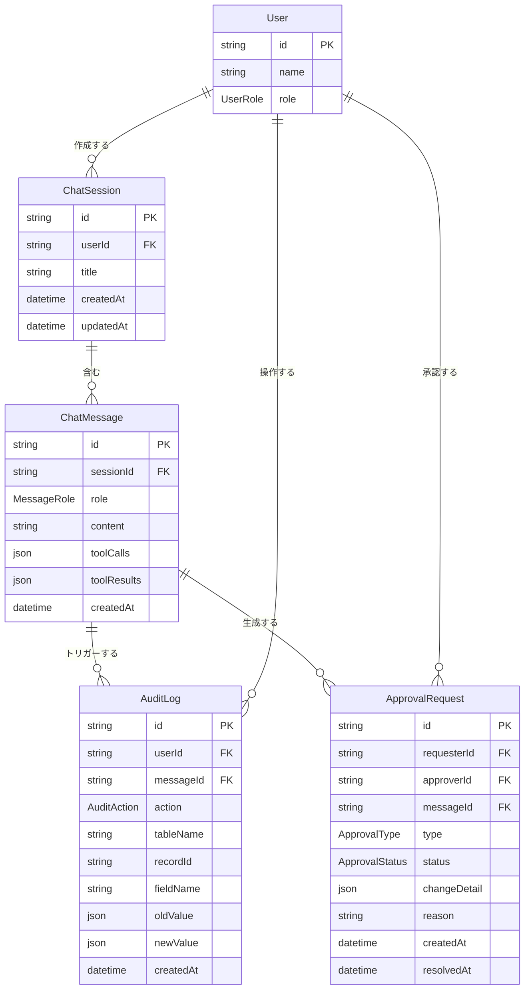

# チャットボット — エンティティ定義

## エンティティ一覧

| # | エンティティ | 説明 |
|---|-------------|------|
| 1 | ChatSession | チャットの会話セッション（スレッド） |
| 2 | ChatMessage | セッション内の個々のメッセージ |
| 3 | AuditLog | データ変更・ナレッジ更新の監査ログ |
| 4 | ApprovalRequest | 決裁申請（データ変更・ナレッジ更新の承認依頼） |

## ER図



## Enum定義

### UserRole — ユーザーロール

| 値 | 説明 |
|----|------|
| `GENERAL` | 一般ユーザー — ナレッジ回答・データ照会のみ |
| `ADMIN` | 管理者 — データ変更・ナレッジ更新申請が可能 |
| `APPROVER` | 決裁者 — 承認/却下の権限を持つ |

### MessageRole — メッセージ送信者

| 値 | 説明 |
|----|------|
| `USER` | ユーザーの発言 |
| `ASSISTANT` | AIの応答 |
| `SYSTEM` | システムメッセージ（確認ステップ、決裁結果通知など） |

### AuditAction — 監査アクション

| 値 | 説明 |
|----|------|
| `CREATE` | レコードの新規作成 |
| `UPDATE` | レコードの更新 |
| `DELETE` | レコードの削除 |
| `KNOWLEDGE_UPDATE` | ナレッジ（Markdown）の更新 |

### ApprovalType — 決裁種別

| 値 | 説明 |
|----|------|
| `DATA_CHANGE` | データ変更の決裁 |
| `KNOWLEDGE_UPDATE` | ナレッジ更新の決裁 |

### ApprovalStatus — 決裁ステータス

| 値 | 説明 |
|----|------|
| `PENDING` | 承認待ち |
| `APPROVED` | 承認済み |
| `REJECTED` | 却下 |

## エンティティ詳細

### ChatSession — チャットセッション

1つの会話スレッドを表す。ユーザーがチャットを開始するたびに作成される。

| フィールド | 型 | 必須 | 説明 |
|-----------|-----|:---:|------|
| id | String | YES | 一意識別子 |
| userId | String (FK → User) | YES | 作成したユーザー |
| title | String | NO | セッションのタイトル（最初の質問から自動生成） |
| createdAt | DateTime | YES | 作成日時 |
| updatedAt | DateTime | YES | 最終更新日時 |

### ChatMessage — チャットメッセージ

セッション内の個々のメッセージ。ユーザーの発言、AIの応答、システムメッセージを全て含む。

| フィールド | 型 | 必須 | 説明 |
|-----------|-----|:---:|------|
| id | String | YES | 一意識別子 |
| sessionId | String (FK → ChatSession) | YES | 所属セッション |
| role | MessageRole | YES | 送信者の種別 |
| content | String | YES | メッセージ本文 |
| toolCalls | Json | NO | Claude API の Tool Use 呼び出し内容 |
| toolResults | Json | NO | Tool Use の実行結果 |
| createdAt | DateTime | YES | 作成日時 |

### AuditLog — 監査ログ

全テーブル共通の変更履歴。チャットボット経由・画面直接変更の両方を記録する。

| フィールド | 型 | 必須 | 説明 |
|-----------|-----|:---:|------|
| id | String | YES | 一意識別子 |
| userId | String (FK → User) | YES | 操作したユーザー |
| messageId | String (FK → ChatMessage) | NO | チャットボット経由の場合、トリガーとなったメッセージ |
| action | AuditAction | YES | 操作種別 |
| tableName | String | YES | 対象テーブル名（ナレッジ更新の場合はファイルパス） |
| recordId | String | NO | 対象レコードID |
| fieldName | String | NO | 変更したフィールド名 |
| oldValue | Json | NO | 変更前の値 |
| newValue | Json | NO | 変更後の値 |
| createdAt | DateTime | YES | 操作日時 |

### ApprovalRequest — 決裁申請

データ変更・ナレッジ更新の承認依頼を管理する。

| フィールド | 型 | 必須 | 説明 |
|-----------|-----|:---:|------|
| id | String | YES | 一意識別子 |
| requesterId | String (FK → User) | YES | 申請者 |
| approverId | String (FK → User) | NO | 決裁者（未割当ての場合は NULL） |
| messageId | String (FK → ChatMessage) | YES | 申請のトリガーとなったメッセージ |
| type | ApprovalType | YES | 決裁種別 |
| status | ApprovalStatus | YES | 決裁ステータス |
| changeDetail | Json | YES | 変更内容の詳細（変更前後の値など） |
| reason | String | NO | 却下理由 |
| createdAt | DateTime | YES | 申請日時 |
| resolvedAt | DateTime | NO | 承認/却下日時 |

## 既存エンティティとの関係

### Staff テーブルへの変更

既存の Staff エンティティに `userRole` フィールドを追加する。

```
Staff（既存）
├ id          — UUID
├ name        — 氏名
├ ...         — 既存フィールド
└ userRole    — UserRole（新規追加）← デフォルト: GENERAL
```

### 他のテーブルへの影響

AuditLog は全テーブルの変更を記録するが、各テーブル自体への変更は不要。
`tableName` + `recordId` の組み合わせで対象レコードを特定する設計（ポリモーフィック参照）。
