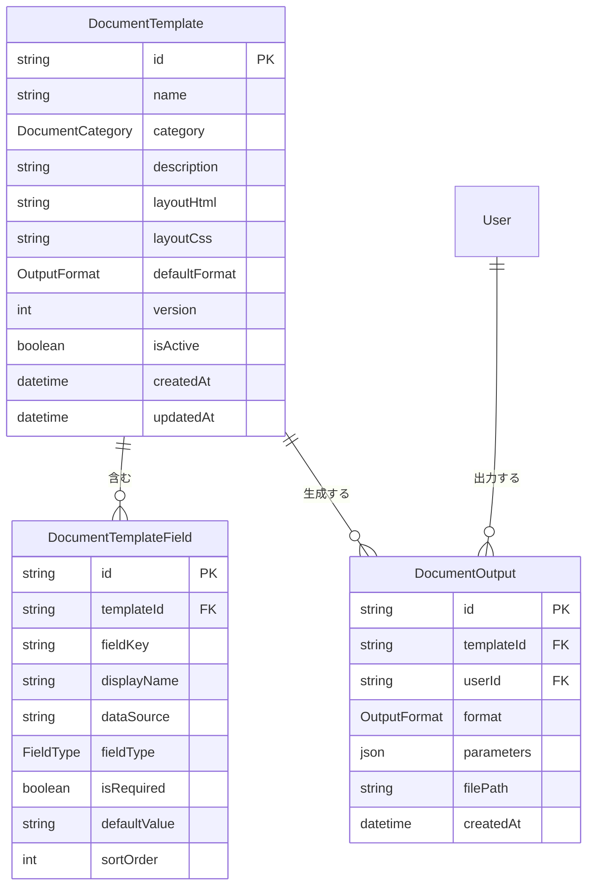

# 帳票出力 — エンティティ定義

## エンティティ一覧

| # | エンティティ | 説明 |
|---|-------------|------|
| 1 | DocumentTemplate | 帳票テンプレート（書式定義） |
| 2 | DocumentTemplateField | テンプレートの差し込みフィールド定義 |
| 3 | DocumentOutput | 生成された帳票の出力履歴 |

## ER図

## Enum定義

### DocumentCategory — 帳票カテゴリ

| 値 | 説明 |
|----|------|
| `CERTIFICATE` | 証明書（出席証明、在籍証明、卒業証明など） |
| `IMMIGRATION` | 入管書類（離脱届、定期報告など） |
| `INTERNAL` | 社内文書（報告書など） |

### OutputFormat — 出力形式

| 値 | 説明 |
|----|------|
| `PDF` | PDF形式 |
| `EXCEL` | Excel形式 |

### FieldType — フィールド型

| 値 | 説明 |
|----|------|
| `TEXT` | テキスト（学生名、学校名など） |
| `DATE` | 日付（発行日、期間など） |
| `NUMBER` | 数値（出席率、金額など） |
| `TABLE` | 表データ（出席一覧、成績一覧など） |
| `PARAMETER` | ユーザーが出力時に指定するパラメータ（期間など） |

## エンティティ詳細

### DocumentTemplate — 帳票テンプレート

帳票の書式定義。DB に保存し、プロンプトで修正・新規作成が可能。

| フィールド | 型 | 必須 | 説明 |
|-----------|-----|:---:|------|
| id | String | YES | 一意識別子 |
| name | String | YES | テンプレート名（例: 出席成績証明書） |
| category | DocumentCategory | YES | カテゴリ |
| description | String | NO | 説明・用途 |
| layoutHtml | String | YES | HTML形式のレイアウト定義 |
| layoutCss | String | NO | CSS形式のスタイル定義 |
| defaultFormat | OutputFormat | YES | デフォルトの出力形式 |
| version | Int | YES | バージョン番号（変更のたびにインクリメント） |
| isActive | Boolean | YES | 有効/無効（削除ではなく無効化） |
| createdAt | DateTime | YES | 作成日時 |
| updatedAt | DateTime | YES | 最終更新日時 |

### DocumentTemplateField — 差し込みフィールド

テンプレートに差し込むデータの定義。どのテーブルのどのフィールドを使うかを指定する。

| フィールド | 型 | 必須 | 説明 |
|-----------|-----|:---:|------|
| id | String | YES | 一意識別子 |
| templateId | String (FK → DocumentTemplate) | YES | 所属テンプレート |
| fieldKey | String | YES | フィールドキー（レイアウト内で参照する識別子） |
| displayName | String | YES | 表示名（例: 学生氏名） |
| dataSource | String | YES | データ取得元（例: `Student.name`, `AttendanceRecord.rate`） |
| fieldType | FieldType | YES | フィールドの型 |
| isRequired | Boolean | YES | 必須かどうか |
| defaultValue | String | NO | デフォルト値（PARAMETERタイプ用） |
| sortOrder | Int | YES | 表示順序 |

### DocumentOutput — 出力履歴

生成された帳票の履歴を記録する。

| フィールド | 型 | 必須 | 説明 |
|-----------|-----|:---:|------|
| id | String | YES | 一意識別子 |
| templateId | String (FK → DocumentTemplate) | YES | 使用したテンプレート |
| userId | String (FK → User) | YES | 出力したユーザー |
| format | OutputFormat | YES | 出力した形式 |
| parameters | Json | NO | 出力時のパラメータ（対象学生ID、期間など） |
| filePath | String | YES | 生成ファイルの保存先パス |
| createdAt | DateTime | YES | 出力日時 |

## 既存エンティティとの関係

帳票出力は既存テーブルからデータを**読み取るだけ**で、既存テーブルへの変更は不要。

- `Student` — 学生の基本情報（氏名、生年月日、在籍情報など）
- `AttendanceRecord` / `MonthlyAttendanceRate` — 出席データ
- `StudentCertification` — 試験成績
- `Class` / `ClassEnrollment` — クラス情報
- `ImmigrationTask` / `ImmigrationDocument` — 入管関連データ

テンプレートの `DocumentTemplateField.dataSource` で、どのテーブルのどのフィールドを差し込むかを指定する。
