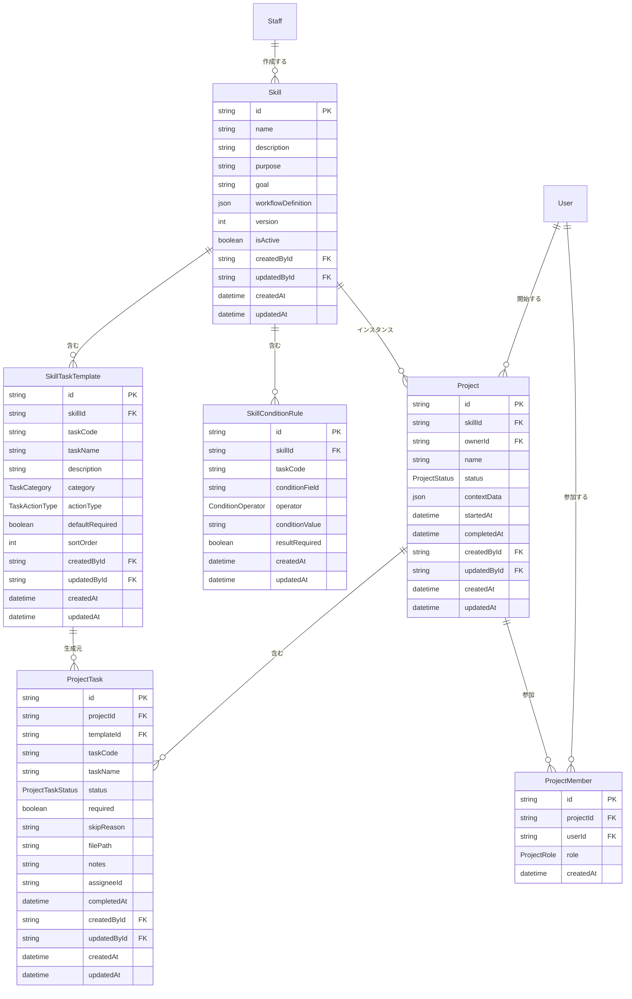

# プロジェクト機能 — エンティティ定義

## エンティティ一覧

| # | エンティティ | 説明 |
|---|-------------|------|
| 1 | Skill | 業務パターンのテンプレート（スキル定義） |
| 2 | SkillTaskTemplate | スキル内のタスクテンプレート |
| 3 | SkillConditionRule | タスクの必要/不要を判定する条件分岐ルール |
| 4 | Project | スキルのインスタンス（具体的な案件の進行管理） |
| 5 | ProjectTask | プロジェクト内の個々のタスク |
| 6 | ProjectMember | プロジェクトの参加者と権限 |

## ER図



## Enum定義

### TaskCategory — タスクカテゴリ

| 値 | 説明 |
|----|------|
| `DOCUMENT_CREATION` | 書類作成（当社が作成する書類） |
| `DOCUMENT_COLLECTION` | 書類収集（外部から収集する書類） |
| `DATA_ENTRY` | データ入力 |
| `REVIEW` | 確認・レビュー |
| `OUTPUT` | 成果物の出力 |

### TaskActionType — タスクのアクション種別

| 値 | 説明 |
|----|------|
| `FILE_UPLOAD` | ファイルアップロード |
| `FORM_INPUT` | フォーム入力 |
| `AUTO_GENERATE` | 自動生成（DBデータから書類を生成） |
| `MANUAL_CHECK` | 手動確認 |

### ConditionOperator — 条件分岐演算子

| 値 | 説明 | 例 |
|----|------|-----|
| `EQUALS` | 一致 | 分野 = 介護 |
| `NOT_EQUALS` | 不一致 | |
| `IN` | いずれかに一致 | 国籍 IN [カンボジア, タイ, ベトナム] |
| `IS_TRUE` | true | 技能実習2号修了 = true |
| `IS_FALSE` | false | 技能実習2号修了 = false |

### ProjectStatus — プロジェクトステータス

| 値 | 説明 |
|----|------|
| `ACTIVE` | 進行中 |
| `COMPLETED` | 完了 |
| `SUSPENDED` | 中断 |
| `CANCELLED` | 取消 |

### ProjectTaskStatus — タスクステータス

| 値 | 説明 |
|----|------|
| `NOT_STARTED` | 未着手 |
| `IN_PROGRESS` | 対応中 |
| `COMPLETED` | 完了 |
| `NOT_REQUIRED` | 不要（条件分岐で免除） |
| `RETURNED` | 差戻し |

### ProjectRole — プロジェクト内の権限

| 値 | 説明 |
|----|------|
| `OWNER` | オーナー。全操作 + 権限設定 |
| `EDITOR` | 編集者。タスク操作が可能 |
| `VIEWER` | 閲覧者。進捗の閲覧のみ |

## エンティティ詳細

### Skill — スキル定義

業務パターンのテンプレート。DBに保存し、プロンプトで新規作成・修正が可能。

| フィールド | 型 | 必須 | 説明 |
|-----------|-----|:---:|------|
| id | String | YES | 一意識別子 |
| name | String | YES | スキル名（例: 特定技能申請） |
| description | String | NO | スキルの説明 |
| purpose | String | YES | 目的（例: 特定技能の在留資格変更許可申請） |
| goal | String | YES | 完了条件（例: 入管への申請書類を提出） |
| workflowDefinition | Json | YES | ワークフローの定義（ステップ・順序・条件） |
| version | Int | YES | バージョン番号 |
| isActive | Boolean | YES | 有効/無効 |
| createdById | String (FK → Staff) | NO | 作成者 |
| updatedById | String (FK → Staff) | NO | 更新者 |
| createdAt | DateTime | YES | 作成日時 |
| updatedAt | DateTime | YES | 最終更新日時 |

### SkillTaskTemplate — タスクテンプレート

スキル内のタスクの雛形。プロジェクト作成時にこの定義からタスクが生成される。

| フィールド | 型 | 必須 | 説明 |
|-----------|-----|:---:|------|
| id | String | YES | 一意識別子 |
| skillId | String (FK → Skill) | YES | 所属スキル |
| taskCode | String | YES | タスクコード（例: DOC-001, COL-012） |
| taskName | String | YES | タスク名（例: 在留資格変更許可申請書） |
| description | String | NO | 詳細説明・注意事項 |
| category | TaskCategory | YES | カテゴリ |
| actionType | TaskActionType | YES | アクション種別 |
| defaultRequired | Boolean | YES | デフォルトで必須かどうか |
| sortOrder | Int | YES | 表示順序 |
| createdById | String (FK → Staff) | NO | 作成者 |
| updatedById | String (FK → Staff) | NO | 更新者 |
| createdAt | DateTime | YES | 作成日時 |
| updatedAt | DateTime | YES | 最終更新日時 |

### SkillConditionRule — 条件分岐ルール

タスクの必要/不要を判定するルール。プロジェクト開始時に対象者の属性と照合して判定する。

| フィールド | 型 | 必須 | 説明 |
|-----------|-----|:---:|------|
| id | String | YES | 一意識別子 |
| skillId | String (FK → Skill) | YES | 所属スキル |
| taskCode | String | YES | 対象タスクコード |
| conditionField | String | YES | 判定に使うフィールド（例: nationality, sswField） |
| operator | ConditionOperator | YES | 演算子 |
| conditionValue | String | YES | 条件値（例: NURSING_CARE, true） |
| resultRequired | Boolean | YES | 条件に一致した場合の必須/不要 |
| createdAt | DateTime | YES | 作成日時 |
| updatedAt | DateTime | YES | 最終更新日時 |

#### 初期スキル（特定技能申請）の条件分岐ルール

| 対象タスク | 条件フィールド | 演算子 | 条件値 | 結果 |
|-----------|--------------|--------|--------|------|
| COL-003, COL-004 | hasCompletedTitp2 | IS_TRUE | — | 不要（免除） |
| COL-020 | sswField | EQUALS | NURSING_CARE | 必須 |
| COL-021 | sswField | EQUALS | ACCOMMODATION | 必須 |
| COL-022, COL-023 | sswField | EQUALS | AUTO_TRANSPORT | 必須 |
| COL-019 | nationality | IN | KHM,THA,VNM | 必須 |
| COL-008, COL-009 | insuranceType | EQUALS | NATIONAL_HEALTH | 必須 |
| COL-010, COL-011 | pensionType | EQUALS | NATIONAL_PENSION | 必須 |

### Project — プロジェクト

スキルのインスタンス。具体的な案件の進行管理単位。

| フィールド | 型 | 必須 | 説明 |
|-----------|-----|:---:|------|
| id | String | YES | 一意識別子 |
| skillId | String (FK → Skill) | YES | 使用するスキル |
| ownerId | String (FK → User) | YES | プロジェクト開始者 |
| name | String | YES | プロジェクト名（例: 田中太郎の特定技能申請） |
| status | ProjectStatus | YES | ステータス |
| contextData | Json | YES | プロジェクト固有のデータ（対象学生ID、企業ID等） |
| startedAt | DateTime | YES | 開始日時 |
| completedAt | DateTime | NO | 完了日時 |
| createdById | String (FK → Staff) | NO | 作成者 |
| updatedById | String (FK → Staff) | NO | 更新者 |
| createdAt | DateTime | YES | 作成日時 |
| updatedAt | DateTime | YES | 最終更新日時 |

#### contextData の例（特定技能申請）

```json
{
  "studentId": "student-uuid",
  "companyId": "company-uuid",
  "sswField": "NURSING_CARE",
  "sswCaseId": "case-uuid"
}
```

### ProjectTask — プロジェクトタスク

プロジェクト内の個々のタスク。スキルのタスクテンプレートから生成される。

| フィールド | 型 | 必須 | 説明 |
|-----------|-----|:---:|------|
| id | String | YES | 一意識別子 |
| projectId | String (FK → Project) | YES | 所属プロジェクト |
| templateId | String (FK → SkillTaskTemplate) | YES | 生成元のテンプレート |
| taskCode | String | YES | タスクコード |
| taskName | String | YES | タスク名 |
| status | ProjectTaskStatus | YES | ステータス |
| required | Boolean | YES | 必須かどうか（条件分岐で判定済み） |
| skipReason | String | NO | 不要の理由（例: 技能実習2号修了のため免除） |
| filePath | String | NO | アップロードしたファイルのパス（Box） |
| notes | String | NO | メモ・注記事項 |
| assigneeId | String (FK → User) | NO | 担当者 |
| completedAt | DateTime | NO | 完了日時 |
| createdById | String (FK → Staff) | NO | 作成者 |
| updatedById | String (FK → Staff) | NO | 更新者 |
| createdAt | DateTime | YES | 作成日時 |
| updatedAt | DateTime | YES | 最終更新日時 |

### ProjectMember — プロジェクトメンバー

プロジェクトの参加者と権限。プロジェクト開始者が設定する。

| フィールド | 型 | 必須 | 説明 |
|-----------|-----|:---:|------|
| id | String | YES | 一意識別子 |
| projectId | String (FK → Project) | YES | 所属プロジェクト |
| userId | String (FK → User) | YES | 参加ユーザー |
| role | ProjectRole | YES | プロジェクト内の権限 |
| createdAt | DateTime | YES | 追加日時 |

## 既存エンティティとの関係

### 特定技能エンティティとの連携

プロジェクト機能は [特定技能エンティティ](../15-specified-skilled-worker/01-entity.md) と以下のように連携する。

| プロジェクト | 特定技能 | 関係 |
|-------------|---------|------|
| Project.contextData.sswCaseId | SswCase.id | プロジェクトが案件に紐づく |
| ProjectTask.taskCode | CaseDocument.documentCode | タスクと書類ステータスが対応 |
| ProjectTask.status | CaseDocument.status | タスク完了 → 書類ステータスも更新 |

### 変更が必要な既存エンティティ

なし。Project は contextData（JSON）で既存エンティティのIDを参照する設計のため、既存テーブルへのカラム追加は不要。
